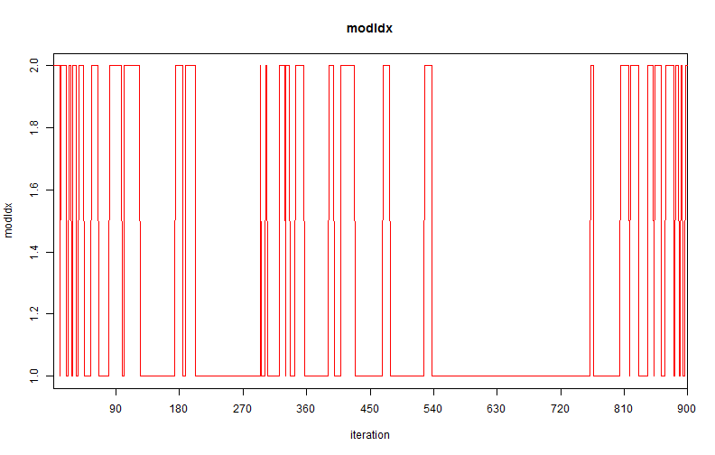
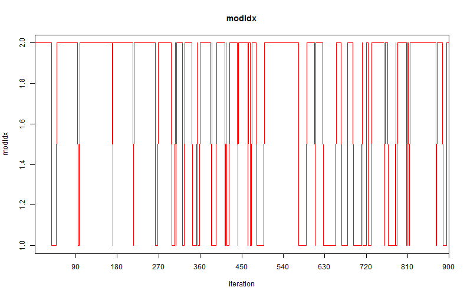
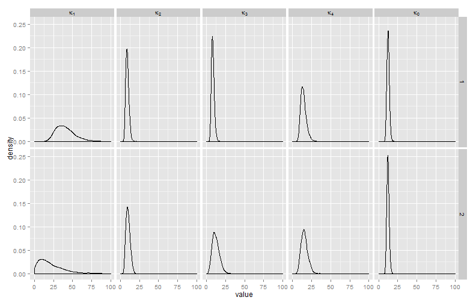
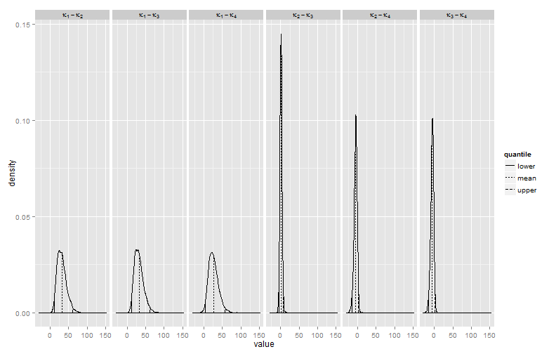

Doing Bayesian Data Analysis
Chapter 10 Homework
========================================================

## Nathan E. Rutenbeck

[GitHub repository for all courswork] (http://github.com/nerutenbeck/bayesian)

--------------------------------------------------------


## 10.2) Toy model

### 10.2.A) Priors: $\nu \sim N(\mu=0, \tau=0.1); \eta \sim \gamma(\alpha=0.1, \beta=0.1)$ Traceplot for model index is shown below.


```
## Compiling model graph
##    Resolving undeclared variables
##    Allocating nodes
##    Graph Size: 54
## 
## Initializing model
```

 


### Probabilities of the models are $p(mod1) = 0.7111$ and $p(mod2) = 0.2889$

### 10.2.B) Priors: $\nu \sim N(\mu=1, \tau=1); \eta \sim \gamma(\alpha=1, \beta=1)$ Traceplot for model index is shown below.


```
## Compiling model graph
##    Resolving undeclared variables
##    Allocating nodes
##    Graph Size: 54
## 
## Initializing model
```

 


### Probabilities of the models are $p(mod1) = 0.7567$ and $p(mod2) = 0.7567$. Based on these model probabilities, model 2 is preferred.

### 10.2.C) The choice of the priors impacts the posterior probabilities of the models because the choice of prior determines in part how often each model gets visited by the Gibbs sampler over the length of the chain.

### 10.2.D) Kruschke suggests a general 'proto-prior'. From my perspective you might as well use a uniform prior over the entire range of possible parameter values. This ensures that estimates are generated from both models, then you can update future iterations of model fitting with new priors. 

## 10.3) Pseudopriors approach


### 10.3.A) Show the modified model


```r
jm2 <- function() {
    
    # Likelihood
    for (i in 1:nSubj) {
        z[i] ~ dbin(theta[i], n[i])
        theta[i] ~ dbeta(aBeta[cond[i]], bBeta[cond[i]])
    }
    
    # Prior
    for (j in 1:nCond) {
        aBeta[j] <- mu[j] * (kappa[j] * equals(mdlIdx, 1) + kappa0 * equals(mdlIdx, 
            2))
        bBeta[j] <- (1 - mu[j]) * (kappa[j] * equals(mdlIdx, 1) + kappa0 * equals(mdlIdx, 
            2))
    }
    
    # Hyperprior on mu and kappa:
    kappa0 ~ dgamma(shk0[mdlIdx], rak0[mdlIdx])
    for (j in 1:nCond) {
        mu[j] ~ dbeta(aHyperbeta, bHyperbeta)
        kappa[j] ~ dgamma(shk[j, mdlIdx], rak[j, mdlIdx])
    }
    
    # Constants for hyperprior:
    aHyperbeta <- 1
    bHyperbeta <- 1
    
    # Actual priors:
    shP <- 1  # shape for prior
    raP <- 0.1  # rate for prior
    # shape, rate kappa0[ model ]
    shk0[2] <- shP
    rak0[2] <- raP
    # shape kappa[ condition , model ]
    shk[1, 1] <- shP
    shk[2, 1] <- shP
    shk[3, 1] <- shP
    shk[4, 1] <- shP
    # rate kappa[ condition , model ]
    rak[1, 1] <- raP
    rak[2, 1] <- raP
    rak[3, 1] <- raP
    rak[4, 1] <- raP
    
    # Pseudo priors: shape, rate kappa0[ model ]
    shk0[1] <- pow(12.312, 2)/pow(1.609, 2)
    rak0[1] <- 12.312/pow(1.609, 2)
    # shape kappa[ condition , model ]
    shk[1, 2] <- pow(22.358, 2)/pow(18.557, 2)
    shk[2, 2] <- pow(10.0415, 2)/pow(2.829, 2)
    shk[3, 2] <- pow(12.219, 2)/pow(4.703, 2)
    shk[4, 2] <- pow(15.777, 2)/pow(4.607, 2)
    # rate kappa[ condition , model ]
    rak[1, 2] <- 22.358/pow(18.557, 2)
    rak[2, 2] <- 10.0415/pow(2.829, 2)
    rak[3, 2] <- 12.219/pow(4.703, 2)
    rak[4, 2] <- 15.777/pow(4.607, 2)
    
    # Hyperprior on model index:
    mdlIdx ~ dcat(modelProb[])
    modelProb[1] <- 0.003
    modelProb[2] <- 0.997
}
```


### 10.3.B) I prefer to show the density curves rather than the histogram....


```
## Compiling model graph
##    Resolving undeclared variables
##    Allocating nodes
##    Graph Size: 1044
## 
## Initializing model
```

 


### 10.3.C) The kappa values for the four groups are different. The way to get the Bayes factor is to divide the ratio of the model probabilities by the ratio of their prior believability. I get 605.5782. The Bayes factor doesn't say anything about which groups are different, only which model fits the data better overall.


```
##    X1.2  X1.3  X1.4    X2.3     X2.4    X3.4
## 1 48.71 50.96 48.07  2.2497  -0.6425  -2.892
## 2 28.26 27.60 14.85 -0.6573 -13.4082 -12.751
## 3 41.51 40.55 35.44 -0.9569  -6.0670  -5.110
## 4 42.37 44.74 35.90  2.3639  -6.4685  -8.832
## 5 36.06 35.61 32.33 -0.4514  -3.7360  -3.285
## 6 65.58 70.33 64.12  4.7509  -1.4584  -6.209
```

```
##                diff value
## 1 kappa[1]-kappa[2] 48.71
## 2 kappa[1]-kappa[2] 28.26
## 3 kappa[1]-kappa[2] 41.51
## 4 kappa[1]-kappa[2] 42.37
## 5 kappa[1]-kappa[2] 36.06
## 6 kappa[1]-kappa[2] 65.58
```

```
##                 diff quantile    value density
## 1  kappa[1]-kappa[2]    lower  11.8068      NA
## 2  kappa[1]-kappa[3]    lower  12.7976      NA
## 3  kappa[1]-kappa[4]    lower   4.6317      NA
## 4  kappa[2]-kappa[3]    lower  -4.6311      NA
## 5  kappa[2]-kappa[4]    lower -15.1301      NA
## 6  kappa[3]-kappa[4]    lower -15.6017      NA
## 7  kappa[1]-kappa[2]     mean  31.5727      NA
## 8  kappa[1]-kappa[3]     mean  32.3424      NA
## 9  kappa[1]-kappa[4]     mean  26.2820      NA
## 10 kappa[2]-kappa[3]     mean   0.7697      NA
## 11 kappa[2]-kappa[4]     mean  -5.2907      NA
## 12 kappa[3]-kappa[4]     mean  -6.0605      NA
## 13 kappa[1]-kappa[2]    upper  60.5866      NA
## 14 kappa[1]-kappa[3]    upper  61.5286      NA
## 15 kappa[1]-kappa[4]    upper  56.9011      NA
## 16 kappa[2]-kappa[3]    upper   6.4596      NA
## 17 kappa[2]-kappa[4]    upper   2.0836      NA
## 18 kappa[3]-kappa[4]    upper   1.2120      NA
```

 

```
##                diff   lower    mean  upper
## 1 kappa[1]-kappa[2]  11.807 31.5727 60.587
## 2 kappa[1]-kappa[3]  12.798 32.3424 61.529
## 3 kappa[1]-kappa[4]   4.632 26.2820 56.901
## 4 kappa[2]-kappa[3]  -4.631  0.7697  6.460
## 5 kappa[2]-kappa[4] -15.130 -5.2907  2.084
## 6 kappa[3]-kappa[4] -15.602 -6.0605  1.212
```


Looks like from the plot of the distributions of the differences and the HPDIs of the differences that theta[1] is different than the rest, but all others are similar.
