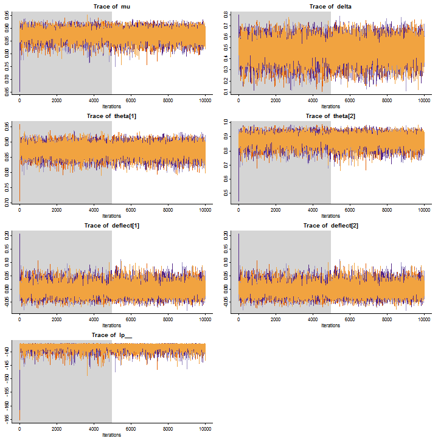
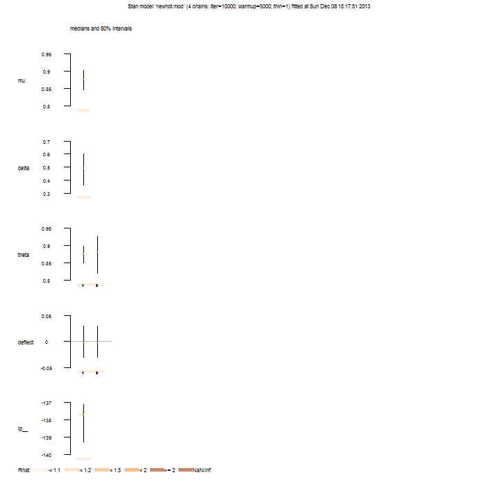
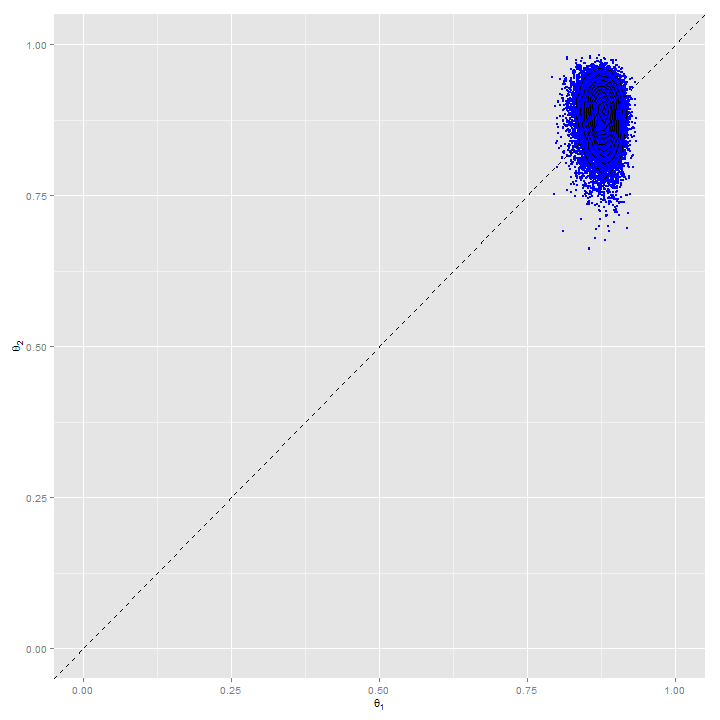

Doing Bayesian Data Analysis
=============================

Chapter 12 & 13 Homework
========================================================
  
  ## Nathan E. Rutenbeck
  
  [GitHub repository for all courswork] (http://github.com/nerutenbeck/bayesian)

--------------------------------------------------------

### 12.2) The hot hand revisted (with Stan!)


### 12.2.A) Fit without data (or is this just not fitting? Hmm...)


```
## Inference for Stan model: newhot.mod.
## 4 chains, each with iter=10000; warmup=5000; thin=1; 
## post-warmup draws per chain=5000, total post-warmup draws=20000.
## 
##             mean se_mean  sd  2.5%   25%   50%   75% 97.5% n_eff Rhat
## mu           0.7       0 0.1   0.5   0.7   0.7   0.8   0.9 14605    1
## delta        0.5       0 0.3   0.0   0.3   0.5   0.7   1.0 14012    1
## theta[1]     0.7       0 0.2   0.3   0.6   0.8   0.9   1.0 13030    1
## theta[2]     0.7       0 0.2   0.3   0.6   0.8   0.9   1.0 13627    1
## deflect[1]   0.0       0 0.2  -0.3  -0.1   0.0   0.1   0.3 12959    1
## deflect[2]   0.0       0 0.2  -0.3  -0.1   0.0   0.1   0.3 12959    1
## lp__       -15.3       0 1.0 -18.1 -15.7 -15.0 -14.6 -14.3  7440    1
## 
## Samples were drawn using NUTS(diag_e) at Thu Dec 05 23:58:07 2013.
## For each parameter, n_eff is a crude measure of effective sample size,
## and Rhat is the potential scale reduction factor on split chains (at 
## convergence, Rhat=1).
```

    


### 12.2.B) Fit the model to the data.


```
## Inference for Stan model: newhot.mod.
## 4 chains, each with iter=10000; warmup=5000; thin=1; 
## post-warmup draws per chain=5000, total post-warmup draws=20000.
## 
##              mean se_mean  sd   2.5%    25%    50%    75%  97.5% n_eff
## mu            0.9       0 0.0    0.8    0.9    0.9    0.9    0.9  9289
## delta         0.5       0 0.1    0.3    0.4    0.5    0.6    0.7  9262
## theta[1]      0.9       0 0.0    0.8    0.9    0.9    0.9    0.9 17250
## theta[2]      0.9       0 0.0    0.8    0.9    0.9    0.9    0.9  8404
## deflect[1]    0.0       0 0.0    0.0    0.0    0.0    0.0    0.0  9243
## deflect[2]    0.0       0 0.0    0.0    0.0    0.0    0.0    0.0  9243
## lp__       -138.0       0 1.0 -140.7 -138.4 -137.7 -137.3 -137.0  6863
##            Rhat
## mu            1
## delta         1
## theta[1]      1
## theta[2]      1
## deflect[1]    1
## deflect[2]    1
## lp__          1
## 
## Samples were drawn using NUTS(diag_e) at Thu Dec 05 23:58:08 2013.
## For each parameter, n_eff is a crude measure of effective sample size,
## and Rhat is the potential scale reduction factor on split chains (at 
## convergence, Rhat=1).
```

    


#### Because the ROPE is inside the highest posterior density interval, we 'fail to reject' the null hypothesis of no difference between success after success and success after failure. I believe another way of looking at this is to say there is a 71.13% probability that the population parameter value is in the region of practical equivalence to zero.
