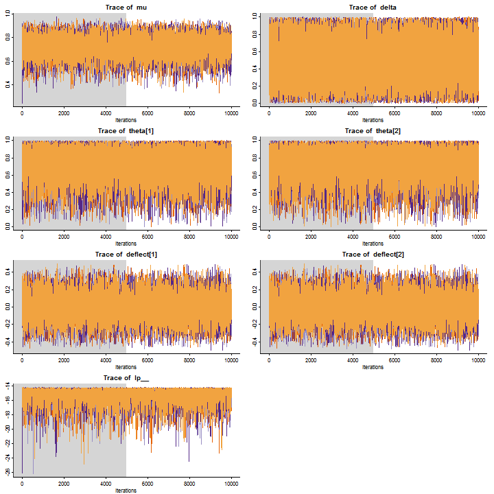

Doing Bayesian Data Analysis
=============================

Chapter 12 & 13 Homework
------------------------
  
## Nathan E. Rutenbeck
  
[GitHub repository for all courswork] (http://github.com/nerutenbeck/bayesian)

--------------------------------------------------------

## 12.2) The hot hand revisted (with Stan!)


### 12.2.A) Fit without data (or is this just not fitting? Hmm...)


```
## Inference for Stan model: newhot.mod.
## 4 chains, each with iter=10000; warmup=5000; thin=1; 
## post-warmup draws per chain=5000, total post-warmup draws=20000.
## 
##             mean se_mean  sd  2.5%   25%   50%   75% 97.5% n_eff Rhat
## mu           0.7       0 0.1   0.5   0.7   0.7   0.8   0.9 14166    1
## delta        0.5       0 0.3   0.0   0.3   0.5   0.8   1.0 12785    1
## theta[1]     0.7       0 0.2   0.3   0.6   0.8   0.9   1.0 12528    1
## theta[2]     0.7       0 0.2   0.3   0.6   0.8   0.9   1.0 12453    1
## deflect[1]   0.0       0 0.2  -0.3  -0.1   0.0   0.1   0.3 12139    1
## deflect[2]   0.0       0 0.2  -0.3  -0.1   0.0   0.1   0.3 12139    1
## lp__       -15.3       0 1.1 -18.2 -15.8 -15.0 -14.6 -14.3  5655    1
## 
## Samples were drawn using NUTS(diag_e) at Sun Dec 08 15:17:48 2013.
## For each parameter, n_eff is a crude measure of effective sample size,
## and Rhat is the potential scale reduction factor on split chains (at 
## convergence, Rhat=1).
```

    


### 12.2.B) Fit the model to the data.


```
## Inference for Stan model: newhot.mod.
## 4 chains, each with iter=10000; warmup=5000; thin=1; 
## post-warmup draws per chain=5000, total post-warmup draws=20000.
## 
##              mean se_mean  sd   2.5%    25%    50%    75%  97.5% n_eff
## mu            0.9       0 0.0    0.8    0.9    0.9    0.9    0.9  8176
## delta         0.5       0 0.1    0.3    0.4    0.5    0.6    0.7  7782
## theta[1]      0.9       0 0.0    0.8    0.9    0.9    0.9    0.9 16256
## theta[2]      0.9       0 0.0    0.8    0.9    0.9    0.9    0.9  7221
## deflect[1]    0.0       0 0.0    0.0    0.0    0.0    0.0    0.0  7758
## deflect[2]    0.0       0 0.0    0.0    0.0    0.0    0.0    0.0  7758
## lp__       -138.0       0 1.0 -140.6 -138.3 -137.7 -137.3 -137.0  7015
##            Rhat
## mu            1
## delta         1
## theta[1]      1
## theta[2]      1
## deflect[1]    1
## deflect[2]    1
## lp__          1
## 
## Samples were drawn using NUTS(diag_e) at Sun Dec 08 15:17:51 2013.
## For each parameter, n_eff is a crude measure of effective sample size,
## and Rhat is the potential scale reduction factor on split chains (at 
## convergence, Rhat=1).
```

    


### Because the ROPE is inside the highest posterior density interval, we 'fail to reject' the null hypothesis of no difference between success after success and success after failure. I believe another way of looking at this is to say there is a 71.13% probability that the population parameter value is in the region of practical equivalence to zero.

### 12.3) Thematic apperperception test. 


### 12.3.A) The first figure below shows the joint probability density of $\mu_1, \mu_2$. The second figure shows $p(\mu_1-\mu_2)$ with $95% HDI = [0.077, 

```

Error in base::parse(text = code, srcfile = NULL) : 1:30: unexpected ']'
1: round(diff.HDI$quantile[2],3)]
                                 ^

```

 and $ROPE = [-0.1, 0.1]$. Based on these figures, we would want ideally to collect more data to see if additional samples would allow our estimates of $\mu_1$ and $\mu_2$ to become more precise, pushing the 95% HDI outside the ROPE. Given the current data, there is an `round(R diff.ROPE$pctIn, 3)` probability that the difference between mothers of normal and schizophrenic children is practically equivalent to zero.


```
## Inference for Stan model: tat.stan.
## 3 chains, each with iter=10000; warmup=5000; thin=1; 
## post-warmup draws per chain=5000, total post-warmup draws=15000.
## 
##              mean se_mean  sd    2.5%     25%     50%     75%   97.5%
## theta[1]      0.8     0.0 0.0     0.7     0.8     0.8     0.8     0.8
## theta[2]      0.4     0.0 0.0     0.4     0.4     0.4     0.4     0.4
## theta[3]      0.6     0.0 0.0     0.5     0.6     0.6     0.6     0.6
## theta[4]      0.3     0.0 0.0     0.3     0.3     0.3     0.3     0.3
## theta[5]      0.1     0.0 0.0     0.1     0.1     0.1     0.1     0.1
## theta[6]      0.4     0.0 0.0     0.4     0.4     0.4     0.4     0.4
## theta[7]      0.4     0.0 0.0     0.4     0.4     0.4     0.4     0.4
## theta[8]      0.6     0.0 0.0     0.5     0.6     0.6     0.6     0.6
## theta[9]      0.4     0.0 0.0     0.4     0.4     0.4     0.4     0.4
## theta[10]     0.2     0.0 0.0     0.2     0.2     0.2     0.2     0.2
## theta[11]     0.2     0.0 0.0     0.2     0.2     0.2     0.2     0.2
## theta[12]     0.1     0.0 0.0     0.1     0.1     0.1     0.1     0.1
## theta[13]     0.1     0.0 0.0     0.1     0.1     0.1     0.1     0.1
## theta[14]     0.4     0.0 0.0     0.4     0.4     0.4     0.4     0.4
## theta[15]     0.3     0.0 0.0     0.3     0.3     0.3     0.3     0.3
## theta[16]     0.3     0.0 0.0     0.3     0.3     0.3     0.3     0.3
## theta[17]     0.2     0.0 0.0     0.2     0.2     0.2     0.2     0.2
## theta[18]     0.6     0.0 0.0     0.5     0.6     0.6     0.6     0.6
## theta[19]     0.3     0.0 0.0     0.3     0.3     0.3     0.3     0.3
## theta[20]     0.4     0.0 0.0     0.4     0.4     0.4     0.4     0.4
## theta[21]     0.2     0.0 0.0     0.2     0.2     0.2     0.2     0.2
## theta[22]     0.1     0.0 0.0     0.1     0.1     0.1     0.1     0.1
## theta[23]     0.1     0.0 0.0     0.1     0.1     0.1     0.1     0.1
## theta[24]     0.3     0.0 0.0     0.3     0.3     0.3     0.3     0.3
## theta[25]     0.2     0.0 0.0     0.2     0.2     0.2     0.2     0.2
## theta[26]     0.7     0.0 0.0     0.6     0.7     0.7     0.7     0.7
## theta[27]     0.2     0.0 0.0     0.2     0.2     0.2     0.2     0.2
## theta[28]     0.1     0.0 0.0     0.1     0.1     0.1     0.1     0.1
## theta[29]     0.3     0.0 0.0     0.3     0.3     0.3     0.3     0.3
## theta[30]     0.1     0.0 0.0     0.1     0.1     0.1     0.1     0.1
## theta[31]     0.0     0.0 0.0     0.0     0.0     0.0     0.0     0.0
## theta[32]     0.2     0.0 0.0     0.2     0.2     0.2     0.2     0.2
## theta[33]     0.4     0.0 0.0     0.3     0.4     0.4     0.4     0.4
## theta[34]     0.2     0.0 0.0     0.2     0.2     0.2     0.2     0.2
## theta[35]     0.3     0.0 0.0     0.3     0.3     0.3     0.3     0.3
## theta[36]     0.3     0.0 0.0     0.3     0.3     0.3     0.3     0.3
## theta[37]     0.0     0.0 0.0     0.0     0.0     0.0     0.0     0.0
## theta[38]     0.1     0.0 0.0     0.1     0.1     0.1     0.1     0.1
## theta[39]     0.2     0.0 0.0     0.2     0.2     0.2     0.2     0.2
## theta[40]     0.2     0.0 0.0     0.2     0.2     0.2     0.2     0.2
## mu[1]         0.3     0.0 0.0     0.3     0.3     0.3     0.4     0.4
## mu[2]         0.2     0.0 0.0     0.1     0.2     0.2     0.2     0.2
## kappa[1]     11.3     0.0 2.6     6.9     9.5    11.1    12.9    16.8
## kappa[2]      9.1     0.0 2.3     5.3     7.5     8.9    10.6    14.1
## a[1]          3.9     0.0 0.9     2.3     3.3     3.9     4.5     5.9
## a[2]          1.7     0.0 0.4     1.0     1.4     1.7     2.0     2.7
## b[1]          7.4     0.0 1.7     4.4     6.2     7.3     8.5    11.1
## b[2]          7.4     0.0 1.9     4.2     6.1     7.2     8.6    11.7
## lp__      -8191.6     0.1 4.7 -8201.8 -8194.6 -8191.3 -8188.4 -8183.4
##           n_eff Rhat
## theta[1]  15000    1
## theta[2]  15000    1
## theta[3]  15000    1
## theta[4]  15000    1
## theta[5]  15000    1
## theta[6]  15000    1
## theta[7]  15000    1
## theta[8]  15000    1
## theta[9]  15000    1
## theta[10] 15000    1
## theta[11] 15000    1
## theta[12] 15000    1
## theta[13] 15000    1
## theta[14] 15000    1
## theta[15] 15000    1
## theta[16] 15000    1
## theta[17] 15000    1
## theta[18] 15000    1
## theta[19] 15000    1
## theta[20] 15000    1
## theta[21] 15000    1
## theta[22] 15000    1
## theta[23] 15000    1
## theta[24] 15000    1
## theta[25] 15000    1
## theta[26] 15000    1
## theta[27] 15000    1
## theta[28] 15000    1
## theta[29] 15000    1
## theta[30] 15000    1
## theta[31] 15000    1
## theta[32] 15000    1
## theta[33] 15000    1
## theta[34] 15000    1
## theta[35] 15000    1
## theta[36] 15000    1
## theta[37] 15000    1
## theta[38] 15000    1
## theta[39] 15000    1
## theta[40] 15000    1
## mu[1]     15000    1
## mu[2]     15000    1
## kappa[1]  15000    1
## kappa[2]  12687    1
## a[1]      15000    1
## a[2]      15000    1
## b[1]      15000    1
## b[2]      12824    1
## lp__       4876    1
## 
## Samples were drawn using NUTS(diag_e) at Sun Dec 08 15:19:27 2013.
## For each parameter, n_eff is a crude measure of effective sample size,
## and Rhat is the potential scale reduction factor on split chains (at 
## convergence, Rhat=1).
```

  

