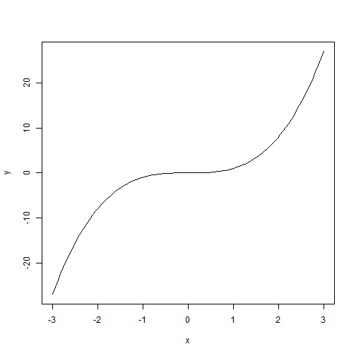

Chapter 2
========================================================

## Nathan E. Rutenbeck
### September 10, 2013
[GitHub repository for all courswork] (http://github.com/nerutenbeck/bayesian)

--------------------------------------------------------

2.1) The proposition that 47 angels can dance on the head of a pin is not testable given that the angels cannot be seen or felt because there is no empirical data that can be associated with the proposition. We therefore can't estimate the posterior probability (no data!). The proposition that 47 anglers can dance on the floor of the bait shop is testable by organizing at least 48 anglers, dancing, and a bait shop then observing how many, in fact, could dance on the floor.

2.3) Upon arriving at the first set of data (all numbers being equal), we modify our prior beliefs to favor model 1, and the probability of models 2 and 3 given the data becomes extremely small (though not zero). In the second case model three becomes more likely given the data.

2.6) I used my own simpler code rather than his example code.


```r
curve(x^3, from = -3, to = 3, ylab = "y")
```

 

