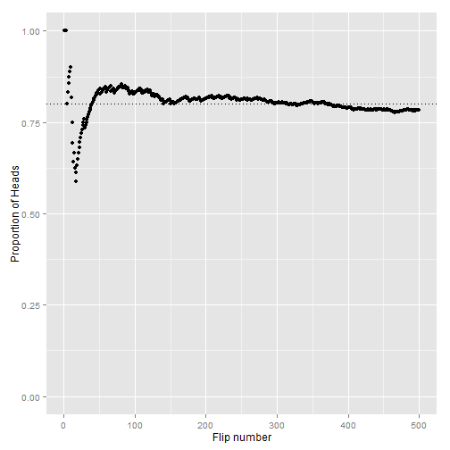
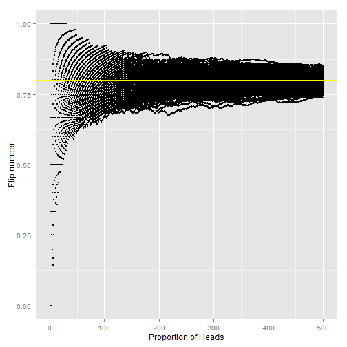
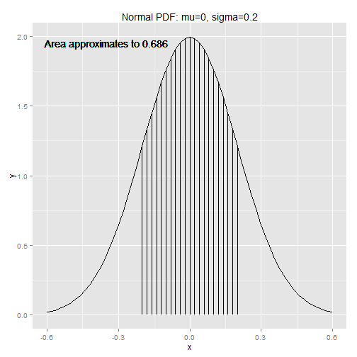
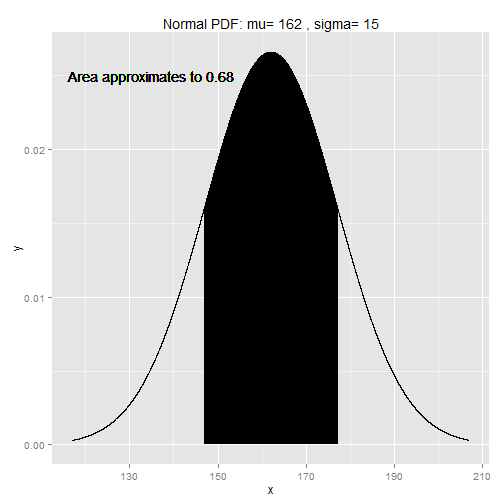

Chapter 3
========================================================

## Nathan E. Rutenbeck
### September 10, 2013
[GitHub repository for all courswork] (http://github.com/nerutenbeck/bayesian)

--------------------------------------------------------


```r
require(ggplot2)
require(reshape2)
```


### 3.1) Modify the coin flipping program such that the coin has $p(H)=0.8$. Change height of reference line.

#### Here is the one trial:


```r
flipper<-function(N,p){ # make a function for whatever probability we like
  df<-data.frame(n=c(1:N), # vector from 1:N
                 trial=sample(x=c(0,1), prob=c(1-p,p), size=N,replace=T)) # Define Boolean sample
  df$r<-cumsum(df$trial)
  df$runprop<-df$r/df$n
  plot<-ggplot(df,aes(x=n,y=runprop))+geom_point()+
    xlim(c(1,N))+ylim(c(0,1))+xlab('Flip number')+ylab('Proportion of Heads')+geom_abline(intercept=p,slope=0,lty=3)
  return(plot)
}
flipper(N=500,p=0.8)
```

 


#### And here is multiple trials just for fun...


```r
flip.dist <- function(n.sims, N, p) {
    tmp <- data.frame(flip = c(1:N))
    for (i in 1:n.sims) {
        tmp[, i + 1] <- (cumsum(sample(x = c(0, 1), prob = c(1 - p, p), size = N, 
            replace = T))/c(1:N))
    }
    df <- melt(tmp, id = "flip")
    plot <- ggplot(df, aes(x = flip, y = value)) + geom_point(cex = 0.8) + geom_abline(intercept = p, 
        slope = 0, color = "yellow") + xlim(c(0, N)) + ylim(c(0, 1)) + xlab("Proportion of Heads") + 
        ylab("Flip number")
    return(plot)
}
flip.dist(n.sims = 1000, N = 500, p = 0.8)
```

 


### 3.4) Use a normal curve to describe beliefs.

#### 3.4.A) First show the normal curve with the indefinite integral approximated numerically


```r
mu = 0  # Define mean
sigma = 0.2  # Define standard deviation
xlow = mu - (3 * sigma)  # Define min for display
xhigh = mu + (3 * sigma)  # Define max for display
dx = 0.02  # Set an arbitrary but low dx
df <- data.frame(x = seq(from = xlow, to = xhigh, by = dx))  # I like to work with dataframes when possible. Define x values
df$y = (1/(sigma * sqrt(2 * pi))) * exp(-0.5 * ((df$x - mu)/sigma)^2)  # Define y values
area = sum(dx * df$y)  # Approximate the indefinite integral

plot <- ggplot(df, aes(x = x, y = y)) + geom_line() + ggtitle("Normal PDF: mu=0, sigma=0.2")  # Build the plot
plot + geom_segment(data = df, aes(x = x, y = 0, xend = x, yend = y)) + geom_text(y = 1.95, 
    x = -0.33, label = paste("Area approximates to", signif(area, 3)))  # Display the normal curve plus indefinite integral
```

 


#### Next show the normal curve with the definite integral from $x-\sigma$ to $x+\sigma$ approximated numerically


```r
xlow2 = mu - sigma
xhigh2 = mu + sigma
df2 <- data.frame(x = seq(from = xlow2, to = xhigh2, by = dx))  # I like to work with dataframes when possible. Define x values
df2$y = (1/(sigma * sqrt(2 * pi))) * exp(-0.5 * ((df2$x - mu)/sigma)^2)  # Define y values
area2 = sum(dx * df2$y) - dx  # Approximate the definite integral between mu-sigma and mu+sigma

plot2 <- plot + geom_segment(data = df2, aes(x = x, y = 0, xend = x, yend = y))  # Build the plot
plot2 + geom_text(y = 1.95, x = -0.35, label = paste("Area approximates to", 
    signif(area2, 3)))  # Display the normal curve plus definite integral
```

 


### 3.4.B) I guess I should just display what this curve looks like and the area below it? The curve below shows the area within the approximately 68% HDI for this belief about the heights of women.


```r
mu = 162  # Define mean
sigma = 162 - 147  # Define standard deviation
xlow = mu - (3 * sigma)  # Define min for display
xhigh = mu + (3 * sigma)  # Define max for display
dx = 0.01  # Set an arbitrary but low dx
df <- data.frame(x = seq(from = xlow, to = xhigh, by = dx))
df$y = (1/(sigma * sqrt(2 * pi))) * exp(-0.5 * ((df$x - mu)/sigma)^2)  # Define y values
area = sum(dx * df$y)  # Approximate the indefinite integral

plot <- ggplot(df, aes(x = x, y = y)) + geom_line() + ggtitle(paste("Normal PDF: mu=", 
    mu, ", sigma=", sigma))  # Build the plot
plot + geom_segment(data = df[df$x > (mu - sigma) & df$x < (mu + sigma), ], 
    aes(x = x, y = 0, xend = x, yend = y)) + geom_text(y = 0.025, x = 135, label = "Area approximates to 0.68")  # Display the normal curve plus indefinite integral
```

 

