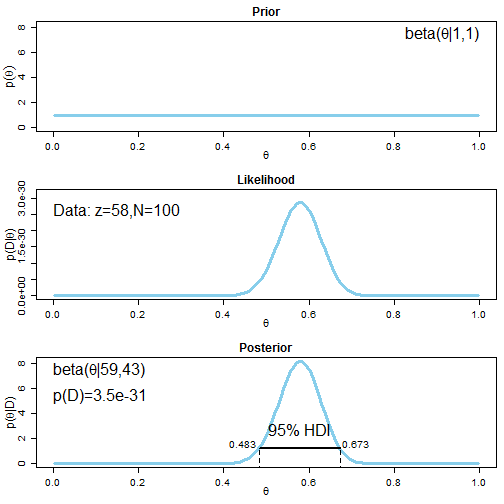
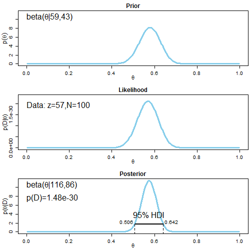
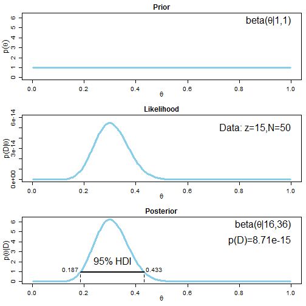
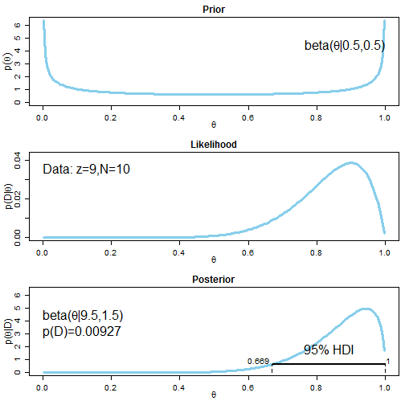
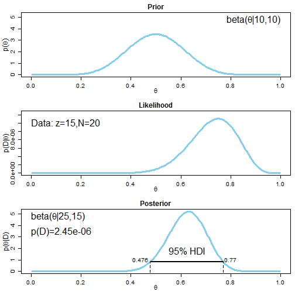
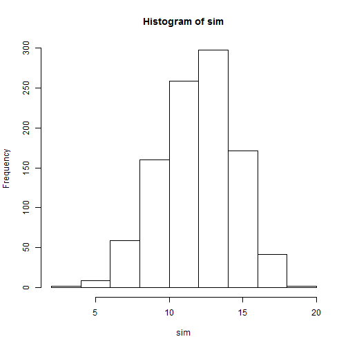
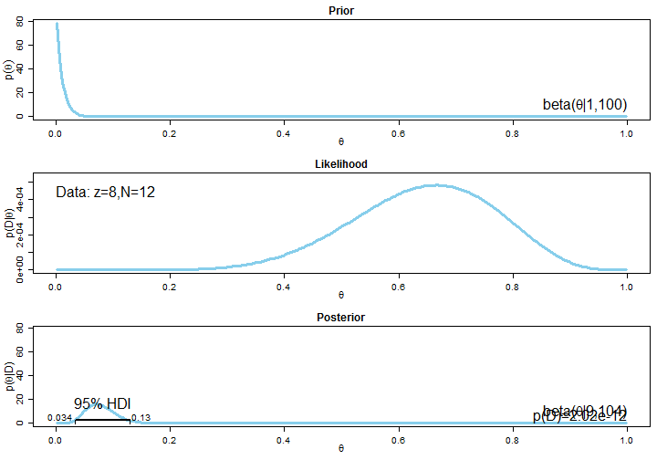
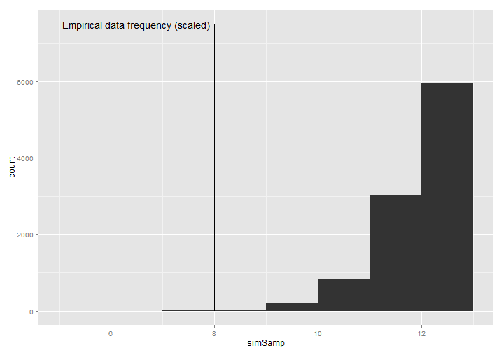

Doing Bayesian Data Analysis
Chapter 5 Homework
========================================================

## Nathan E. Rutenbeck
### September 18, 2013
[GitHub repository for all courswork] (http://github.com/nerutenbeck/bayesian)

--------------------------------------------------------


```r
rm(list = ls())
source("G:/documents/coursework/bayesian/functions/BBeta.R")
```


### 5.2) Two political candidates, A and B. 48 out of 100 polled people prefer Candidate A.

#### 5.2.A) Let Candidate A=1, Candidate B=0. 


```r
X1 <- c(rep(1, 58), rep(0, 42))
BBeta(priorShape = c(1, 1), dataVec = X1)
```

 

```
## [1] 59 43
```


The 95% HDI is $(0.483,0.673)$

#### 5.2.B) Based on the pole it is credible to believe that the nation is equally divided.

#### 5.2.C) New pole results that 57 out of 100 people prever Candidate A...


```r
X2 <- c(rep(1, 57), rep(0, 43))
BBeta(priorShape = c(59, 43), dataVec = X2)
```

 

```
## [1] 116  86
```


New 95% HDI is $(0.506,0.642)$

#### 5.2.D) I guess it depends on the region of practical equivalence. For the purposes of an election in a large state (unless the supreme court steps in...), a relatively small change could make a big difference in the election (0.01% even). In that case, the upper threshold of the ROPE for the 'equal preference' hypothesis is 0.501, which is outside the 95% HDI.

### 5.3) Let Response F=1, Response J=0


```r
X1 <- c(rep(1, 40), rep(0, 10))
BBeta(priorShape = c(1, 1), dataVec = X1)
```

 

```
## [1] 41 11
```


The 95% HDI of $(0.677, 0.893)$ in the first trial leads us to believe in the first case (show 'radio' only) that it is credible that people are biased toward F.


```r
X2 <- c(rep(1, 15), rep(0, 35))
BBeta(priorShape = c(1, 1), dataVec = X2)
```

 

```
## [1] 16 36
```


Teh 95% HDI of $(0.187,0.433)$ in the second trial leads us to credibly believe in this case ('ocean' and 'mountain') that people are biased toward J. (Not sure where I got the values I turned in first, actually...)

### 5.4) Predict the next datum, see influence of priors

#### 5.4.A) Let's go ahead and model it... Let Heads=1, Tails=0. 


```r
X1 <- c(rep(1, 9), rep(0, 1))
BBeta(priorShape = c(15, 15), dataVec = X1)
```

 

```
## [1] 24 16
```


I chose a relatively skeptical prior based on the limited knowledge (and assumptions!) I have about the federal mint. My reasoning is that because the mint produces so many coins and because of the problems of couterfeit, they have a strong incentive to normalize the minting process such that the bias in most coins has to be extremely small. Based on this line of thought, unusual events do happen, and I should not let an 'ordinary' unusual event outweigh my former knowledge. That said, however, the probability of heads happening $n=30$ times ($a+b=n$) is so small with a fair coin that I will have to assume some process broke down at the mint the day this coin was manufactured rather than accept the fairness of the coin.  

#### 5.5.B) Again, let's model it. Let Heads=1, Tails=0.


```r
BBeta(priorShape = c(0.5, 0.5), dataVec = X1)
```

 

```
## [1] 9.5 1.5
```


Because of the prior information on the coin that it is a trick coin, I believe it to be biased, but don't know in which direction. When the coin comes up heads 9/10 times, I now have enough information to bet heads on the 11th toss.

### 5.6 Model comparison. For coin X let Heads=1, Tails=0  

In the 'Trick' hypothesis I believe the coin to be biased but have no knowledge of the direction of bias, therefore I assign prior shapes of $a=0.5, b=0.5$.  

In the 'Fair' hypothesis I believe the coin to be unbiased so assign prior shapes of $a=10, b=10$. This belief is not as strong as in 5.5.A because I didn't see this coin minted, but $a+b=20$ flips would convince me of its bias.  


```r
X <- c(rep(1, 15), rep(0, 5))
Trick <- BBeta(priorShape = c(0.5, 0.5), dataVec = X)
```

 

```r
Trick
```

```
## [1] 15.5  5.5
```

```r
Fair <- BBeta(priorShape = c(10, 10), dataVec = X)
```

 

```r
Fair
```

```
## [1] 25 15
```

```r
(BayesFac <- 2.29/2.45)
```

```
## [1] 0.9347
```


Technically model 2 would be considered better given the probability of the evidence p(D) is higher in this model. Because the Bayes Factor is so close to 1 (0.9347), however, we don't have very strong grounds for preference in one model over the other. We should do posterior predictive checking to make sure the model mimics the data well.


```r

sim <- vector(length = 1000)
for (i in 1:length(sim)) {
    # Generate random theta from the posterior distribution in the fair model
    theta <- rbeta(1, shape1 = 25, shape2 = 15)
    # Generate fake data from a Bernoulli distribution with p=theta
    sampleData <- sample(x = c(1, 0), prob = c(theta, 1 - theta), size = 20, 
        replace = T)
    sim[i] <- sum(sampleData)
}
par(mfrow = c(1, 1))
hist(sim, breaks = 10)
```

 


So this of course is a bit of a toy example - we would need more data points (higher n in each sample) to really assess the validity of the model. But these results are not entirely inconsistent with the actual data.

### 5.8 Posterior Predictive Checking

#### Let $p(H)=p(1), p(T)=p(0)$


```r
data <- c(rep(1, 8), rep(0, 4))
(Heads <- BBeta(priorShape = c(100, 1), dataVec = data))
```

 

```
## [1] 108   5
```

```r
(Tails <- BBeta(priorShape = c(1, 100), dataVec = data))
```

 

```
## [1]   9 104
```

```r
priorA = 100
priorB = 1
actualDataZ = 8
actualDataN = 12
postA = priorA + actualDataZ
postB = priorB + actualDataN - actualDataZ
simSampSize <- actualDataN
nSimSamp <- 10000
simSamp <- vector(length = nSimSamp)

for (i in 1:nSimSamp) {
    sampleTheta = rbeta(1, postA, postB)
    sampleData = sample(x = c(0, 1), prob = c(1 - sampleTheta, sampleTheta), 
        size = simSampSize, replace = T)
    simSamp[i] = sum(sampleData)
}
par(mfrow = c(1, 1))
library(ggplot2)
qplot(simSamp, binwidth = 1) + geom_segment(aes(x = 8, xend = 8, y = 0, yend = 7500)) + 
    geom_text(aes(x = 6.5, y = 7500, label = "Empirical data frequency (scaled)"))
```

 


#### 5.8.B) 10,000 samples.
#### 5.8.C) Different values were used (selected at random from a Beta(100,1) distribution with rbeta())
#### 5.8.D) The winning model is not a good model since the distribution of the random samples drawn from the posterior doesn't really match the empirical data (see figure above). The reason this model 'wins' is therefore that it is a closer approximation than the tail-biased model (not saying much).


