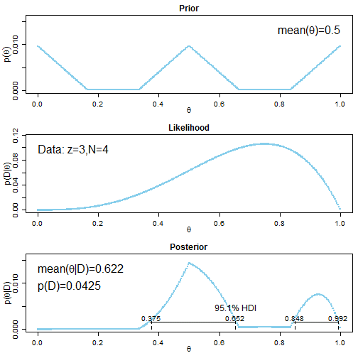
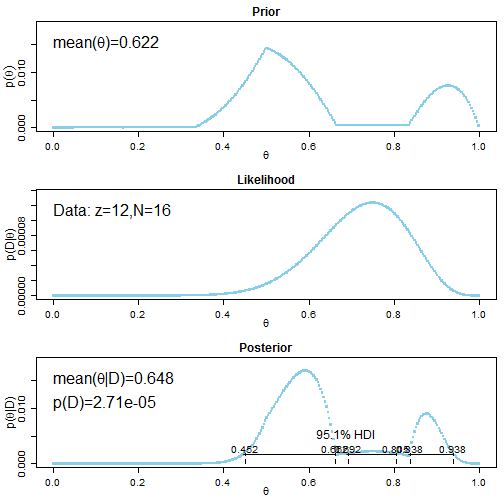

Doing Bayesian Data Analysis
Chapter 6 Homework
========================================================

## Nathan E. Rutenbeck
### October 1, 2013
[GitHub repository for all courswork] (http://github.com/nerutenbeck/bayesian)

--------------------------------------------------------


```r
rm(list = ls())
source("G:/documents/coursework/bayesian/functions/BernGrid.R")
```


### 6.2) Practice specifying a non-beta prior. Specify prior, display posterior beliefs
 

```r
pTheta <- c(50:1, rep(1, 50), 1:50, 50:1, rep(1, 50), 1:50)
pTheta <- pTheta/sum(pTheta)
plot(pTheta, type = "l")
```

 

```r
width <- 1/length(pTheta)
Theta <- seq(from = width/2, to = 1 - width/2, by = width)
data <- c(rep(1, 15), rep(0, 5))
BernGrid(Theta = Theta, pTheta = pTheta, Data = data)
```

 

```
##   [1] 1.765e-38 2.441e-31 5.001e-28 7.491e-26 3.126e-24 6.101e-23 7.186e-22
##   [8] 5.906e-21 3.707e-20 1.887e-19 8.118e-19 3.045e-18 1.018e-17 3.091e-17
##  [15] 8.633e-17 2.243e-16 5.468e-16 1.260e-15 2.763e-15 5.792e-15 1.166e-14
##  [22] 2.262e-14 4.241e-14 7.712e-14 1.363e-13 2.345e-13 3.935e-13 6.454e-13
##  [29] 1.036e-12 1.628e-12 2.510e-12 3.797e-12 5.642e-12 8.240e-12 1.183e-11
##  [36] 1.671e-11 2.321e-11 3.172e-11 4.263e-11 5.632e-11 7.308e-11 9.302e-11
##  [43] 1.159e-10 1.410e-10 1.667e-10 1.901e-10 2.066e-10 2.090e-10 1.867e-10
##  [50] 1.243e-10 1.644e-10 2.163e-10 2.829e-10 3.679e-10 4.759e-10 6.125e-10
##  [57] 7.844e-10 9.997e-10 1.268e-09 1.602e-09 2.014e-09 2.523e-09 3.146e-09
##  [64] 3.909e-09 4.838e-09 5.965e-09 7.329e-09 8.974e-09 1.095e-08 1.332e-08
##  [71] 1.615e-08 1.951e-08 2.351e-08 2.825e-08 3.384e-08 4.042e-08 4.815e-08
##  [78] 5.721e-08 6.780e-08 8.014e-08 9.450e-08 1.112e-07 1.304e-07 1.527e-07
##  [85] 1.784e-07 2.079e-07 2.418e-07 2.807e-07 3.251e-07 3.758e-07 4.335e-07
##  [92] 4.991e-07 5.735e-07 6.578e-07 7.531e-07 8.606e-07 9.818e-07 1.118e-06
##  [99] 1.271e-06 1.443e-06 1.635e-06 3.699e-06 6.268e-06 9.425e-06 1.327e-05
## [106] 1.790e-05 2.344e-05 3.004e-05 3.783e-05 4.699e-05 5.770e-05 7.017e-05
## [113] 8.463e-05 1.013e-04 1.206e-04 1.426e-04 1.678e-04 1.965e-04 2.292e-04
## [120] 2.662e-04 3.081e-04 3.553e-04 4.084e-04 4.680e-04 5.348e-04 6.094e-04
## [127] 6.927e-04 7.853e-04 8.883e-04 1.003e-03 1.129e-03 1.269e-03 1.423e-03
## [134] 1.592e-03 1.779e-03 1.984e-03 2.208e-03 2.454e-03 2.723e-03 3.015e-03
## [141] 3.335e-03 3.682e-03 4.059e-03 4.468e-03 4.911e-03 5.391e-03 5.909e-03
## [148] 6.468e-03 7.071e-03 7.719e-03 8.251e-03 8.636e-03 9.027e-03 9.424e-03
## [155] 9.824e-03 1.023e-02 1.063e-02 1.104e-02 1.145e-02 1.185e-02 1.226e-02
## [162] 1.265e-02 1.304e-02 1.343e-02 1.380e-02 1.416e-02 1.450e-02 1.483e-02
## [169] 1.514e-02 1.543e-02 1.569e-02 1.593e-02 1.614e-02 1.632e-02 1.646e-02
## [176] 1.657e-02 1.663e-02 1.666e-02 1.664e-02 1.657e-02 1.646e-02 1.629e-02
## [183] 1.606e-02 1.577e-02 1.543e-02 1.502e-02 1.454e-02 1.400e-02 1.338e-02
## [190] 1.270e-02 1.193e-02 1.110e-02 1.018e-02 9.191e-03 8.119e-03 6.967e-03
## [197] 5.735e-03 4.421e-03 3.027e-03 1.553e-03 1.593e-03 1.632e-03 1.670e-03
## [204] 1.708e-03 1.745e-03 1.781e-03 1.816e-03 1.850e-03 1.884e-03 1.916e-03
## [211] 1.946e-03 1.975e-03 2.003e-03 2.029e-03 2.054e-03 2.076e-03 2.097e-03
## [218] 2.116e-03 2.132e-03 2.147e-03 2.159e-03 2.169e-03 2.177e-03 2.182e-03
## [225] 2.184e-03 2.184e-03 2.182e-03 2.176e-03 2.168e-03 2.158e-03 2.144e-03
## [232] 2.128e-03 2.109e-03 2.088e-03 2.064e-03 2.037e-03 2.007e-03 1.975e-03
## [239] 1.941e-03 1.904e-03 1.865e-03 1.823e-03 1.780e-03 1.734e-03 1.686e-03
## [246] 1.637e-03 1.586e-03 1.534e-03 1.480e-03 1.425e-03 1.369e-03 2.625e-03
## [253] 3.765e-03 4.790e-03 5.697e-03 6.488e-03 7.164e-03 7.727e-03 8.179e-03
## [260] 8.524e-03 8.766e-03 8.910e-03 8.961e-03 8.925e-03 8.809e-03 8.620e-03
## [267] 8.364e-03 8.051e-03 7.687e-03 7.281e-03 6.841e-03 6.375e-03 5.891e-03
## [274] 5.396e-03 4.899e-03 4.405e-03 3.921e-03 3.454e-03 3.008e-03 2.588e-03
## [281] 2.197e-03 1.839e-03 1.515e-03 1.226e-03 9.733e-04 7.560e-04 5.729e-04
## [288] 4.219e-04 3.006e-04 2.061e-04 1.349e-04 8.341e-05 4.808e-05 2.532e-05
## [295] 1.182e-05 4.661e-06 1.426e-06 2.848e-07 2.377e-08 1.050e-10
```


### 6.3) Use BernGrid for sequential update.


```r
data <- c(0, 1, 1, 1)  # Four trials, 3 heads
(t1 <- BernGrid(Theta = Theta, pTheta = pTheta, Data = data))
```

 

```
##   [1] 1.047e-09 2.760e-08 1.248e-07 3.341e-07 6.926e-07 1.233e-06 1.983e-06
##   [8] 2.967e-06 4.204e-06 5.710e-06 7.496e-06 9.568e-06 1.193e-05 1.458e-05
##  [15] 1.752e-05 2.073e-05 2.421e-05 2.794e-05 3.189e-05 3.605e-05 4.039e-05
##  [22] 4.488e-05 4.949e-05 5.418e-05 5.890e-05 6.363e-05 6.830e-05 7.288e-05
##  [29] 7.732e-05 8.154e-05 8.551e-05 8.916e-05 9.242e-05 9.524e-05 9.754e-05
##  [36] 9.925e-05 1.003e-04 1.006e-04 1.001e-04 9.875e-05 9.639e-05 9.298e-05
##  [43] 8.842e-05 8.264e-05 7.554e-05 6.702e-05 5.701e-05 4.539e-05 3.209e-05
##  [50] 1.699e-05 1.797e-05 1.898e-05 2.003e-05 2.111e-05 2.222e-05 2.337e-05
##  [57] 2.456e-05 2.578e-05 2.703e-05 2.833e-05 2.966e-05 3.102e-05 3.242e-05
##  [64] 3.386e-05 3.534e-05 3.685e-05 3.840e-05 3.998e-05 4.161e-05 4.327e-05
##  [71] 4.497e-05 4.670e-05 4.848e-05 5.029e-05 5.214e-05 5.403e-05 5.595e-05
##  [78] 5.791e-05 5.991e-05 6.195e-05 6.403e-05 6.614e-05 6.829e-05 7.048e-05
##  [85] 7.270e-05 7.497e-05 7.727e-05 7.960e-05 8.197e-05 8.438e-05 8.683e-05
##  [92] 8.931e-05 9.183e-05 9.438e-05 9.697e-05 9.960e-05 1.023e-04 1.049e-04
##  [99] 1.077e-04 1.104e-04 1.132e-04 2.321e-04 3.568e-04 4.873e-04 6.237e-04
## [106] 7.662e-04 9.149e-04 1.070e-03 1.231e-03 1.399e-03 1.573e-03 1.753e-03
## [113] 1.941e-03 2.135e-03 2.336e-03 2.543e-03 2.758e-03 2.980e-03 3.209e-03
## [120] 3.445e-03 3.688e-03 3.938e-03 4.196e-03 4.462e-03 4.734e-03 5.015e-03
## [127] 5.302e-03 5.598e-03 5.901e-03 6.211e-03 6.530e-03 6.856e-03 7.190e-03
## [134] 7.531e-03 7.881e-03 8.238e-03 8.603e-03 8.976e-03 9.357e-03 9.745e-03
## [141] 1.014e-02 1.055e-02 1.096e-02 1.138e-02 1.181e-02 1.224e-02 1.268e-02
## [148] 1.313e-02 1.359e-02 1.406e-02 1.425e-02 1.415e-02 1.404e-02 1.393e-02
## [155] 1.380e-02 1.367e-02 1.353e-02 1.339e-02 1.323e-02 1.307e-02 1.290e-02
## [162] 1.272e-02 1.254e-02 1.234e-02 1.214e-02 1.193e-02 1.172e-02 1.149e-02
## [169] 1.126e-02 1.102e-02 1.077e-02 1.051e-02 1.025e-02 9.975e-03 9.695e-03
## [176] 9.408e-03 9.113e-03 8.810e-03 8.501e-03 8.184e-03 7.859e-03 7.527e-03
## [183] 7.189e-03 6.843e-03 6.490e-03 6.130e-03 5.764e-03 5.391e-03 5.011e-03
## [190] 4.625e-03 4.233e-03 3.835e-03 3.430e-03 3.020e-03 2.604e-03 2.183e-03
## [197] 1.756e-03 1.325e-03 8.878e-04 4.462e-04 4.484e-04 4.506e-04 4.527e-04
## [204] 4.547e-04 4.567e-04 4.586e-04 4.604e-04 4.621e-04 4.637e-04 4.653e-04
## [211] 4.668e-04 4.682e-04 4.695e-04 4.707e-04 4.718e-04 4.729e-04 4.738e-04
## [218] 4.746e-04 4.754e-04 4.760e-04 4.766e-04 4.770e-04 4.773e-04 4.776e-04
## [225] 4.777e-04 4.777e-04 4.776e-04 4.773e-04 4.770e-04 4.765e-04 4.759e-04
## [232] 4.752e-04 4.744e-04 4.734e-04 4.723e-04 4.711e-04 4.697e-04 4.682e-04
## [239] 4.665e-04 4.647e-04 4.628e-04 4.607e-04 4.585e-04 4.561e-04 4.536e-04
## [246] 4.509e-04 4.481e-04 4.451e-04 4.419e-04 4.386e-04 4.351e-04 8.628e-04
## [253] 1.283e-03 1.694e-03 2.097e-03 2.490e-03 2.873e-03 3.246e-03 3.608e-03
## [260] 3.957e-03 4.295e-03 4.620e-03 4.931e-03 5.228e-03 5.510e-03 5.777e-03
## [267] 6.027e-03 6.261e-03 6.478e-03 6.676e-03 6.856e-03 7.016e-03 7.156e-03
## [274] 7.276e-03 7.373e-03 7.448e-03 7.500e-03 7.528e-03 7.531e-03 7.509e-03
## [281] 7.460e-03 7.384e-03 7.280e-03 7.148e-03 6.985e-03 6.792e-03 6.568e-03
## [288] 6.312e-03 6.022e-03 5.698e-03 5.339e-03 4.945e-03 4.513e-03 4.043e-03
## [295] 3.535e-03 2.987e-03 2.398e-03 1.767e-03 1.093e-03 3.756e-04
```

```r
data2 <- c(rep(1, 12), rep(0, 4))
t2 <- BernGrid(Theta = Theta, pTheta = t1, Data = data2)
```

 


### 6.4) Connect HDIs to the real world.

#### 6.4.A) Prior belief is neutral uniform distribution (0.5). Let $p(1)=p(A), p(0)=p(B)$.


```r
Theta <- seq(from = 0, to = 1, by = 0.01)
pTheta <- c(rep(1/101, length(Theta)))
data <- c(rep(1, 58), rep(0, 42))
(t1 <- BernGrid(Theta = Theta, pTheta = pTheta, Data = data))
```

 

```
##   [1] 0.000e+00 1.871e-88 3.521e-71 3.740e-61 4.269e-54 1.148e-48 2.881e-44
##   [8] 1.404e-40 2.060e-37 1.206e-34 3.417e-32 5.378e-30 5.203e-28 3.342e-26
##  [15] 1.513e-24 5.062e-23 1.301e-21 2.647e-20 4.380e-19 6.019e-18 6.998e-17
##  [22] 6.991e-16 6.081e-15 4.659e-14 3.176e-13 1.943e-12 1.076e-11 5.422e-11
##  [29] 2.504e-10 1.065e-09 4.194e-09 1.535e-08 5.243e-08 1.677e-07 5.036e-07
##  [36] 1.425e-06 3.807e-06 9.627e-06 2.309e-05 5.261e-05 1.141e-04 2.359e-04
##  [43] 4.655e-04 8.778e-04 1.584e-03 2.735e-03 4.529e-03 7.190e-03 1.095e-02
##  [50] 1.602e-02 2.252e-02 3.039e-02 3.943e-02 4.916e-02 5.890e-02 6.783e-02
##  [57] 7.506e-02 7.978e-02 8.143e-02 7.977e-02 7.495e-02 6.750e-02 5.822e-02
##  [64] 4.805e-02 3.790e-02 2.853e-02 2.047e-02 1.398e-02 9.063e-03 5.571e-03
##  [71] 3.238e-03 1.775e-03 9.149e-04 4.421e-04 1.994e-04 8.366e-05 3.247e-05
##  [78] 1.160e-05 3.791e-06 1.125e-06 3.006e-07 7.166e-08 1.507e-08 2.760e-09
##  [85] 4.332e-10 5.723e-11 6.220e-12 5.410e-13 3.640e-14 1.814e-15 6.332e-17
##  [92] 1.439e-18 1.927e-20 1.323e-22 3.795e-25 3.313e-28 5.173e-32 5.337e-37
##  [99] 3.889e-44 1.593e-56 0.000e+00
```


#### 6.4.B) It is still credible to believe (based on 95% HDI) that the population is equally divided.

#### 6.4.C) Update beliefs with new data.


```r
data2 <- c(rep(1, 57), rep(0, 43))
(t2 <- BernGrid(Theta = Theta, pTheta = t1, Data = data2))
```

 

```
##   [1]  0.000e+00 8.187e-173 1.435e-138 1.068e-118 1.033e-104  5.918e-94
##   [7]  3.072e-85  6.187e-78  1.152e-71  3.472e-66  2.482e-61  5.527e-57
##  [13]  4.688e-53  1.765e-49  3.321e-46  3.430e-43  2.097e-40  8.080e-38
##  [19]  2.064e-35  3.648e-33  4.626e-31  4.342e-29  3.096e-27  1.716e-25
##  [25]  7.544e-24  2.676e-22  7.776e-21  1.877e-19  3.807e-18  6.560e-17
##  [31]  9.692e-16  1.239e-14  1.379e-13  1.348e-12  1.163e-11  8.904e-11
##  [37]  6.085e-10  3.726e-09  2.054e-08  1.022e-07  4.612e-07  1.891e-06
##  [43]  7.066e-06  2.412e-05  7.537e-05  2.160e-04  5.685e-04  1.377e-03
##  [49]  3.070e-03  6.312e-03  1.197e-02  2.096e-02  3.389e-02  5.060e-02
##  [55]  6.980e-02  8.890e-02  1.045e-01  1.134e-01  1.134e-01  1.044e-01
##  [61]  8.844e-02  6.880e-02  4.907e-02  3.202e-02  1.908e-02  1.035e-02
##  [67]  5.098e-03  2.272e-03  9.129e-04  3.293e-04  1.061e-04  3.039e-05
##  [73]  7.688e-06  1.707e-06  3.300e-07  5.509e-08  7.864e-09  9.494e-10
##  [79]  9.571e-11  7.941e-12  5.334e-13  2.844e-14  1.177e-15  3.684e-17
##  [85]  8.442e-19  1.365e-20  1.487e-22  1.033e-24  4.266e-27  9.602e-30
##  [91]  1.052e-32  4.836e-36  7.628e-40  3.112e-44  2.171e-49  1.364e-55
##  [97]  2.633e-63  2.081e-73  7.289e-88 6.056e-113  0.000e+00
```


#### 6.4.D) It is no longer credible to believe that the population is equally divided.

### 6.7) Use a grid approximation to compare models

```r
theta <- seq(from = 0, to = 1, by = 0.01)
pTheta1 <- c(theta^2/sum(theta^2))
pTheta2 <- c((1 - theta)^2/sum((1 - theta)^2))
data <- c(rep(1, 6), rep(0, 2))
mod1 <- BernGrid(Theta = theta, pTheta = pTheta1, Data = data)
```

 

```r
mod2 <- BernGrid(Theta = theta, pTheta = pTheta2, Data = data)
```

 

```r
(BF <- 0.00597/0.00128)
```

```
## [1] 4.664
```

#### Bayes factor of Model1:Model2 = 4.664. Model 1 appears better,
