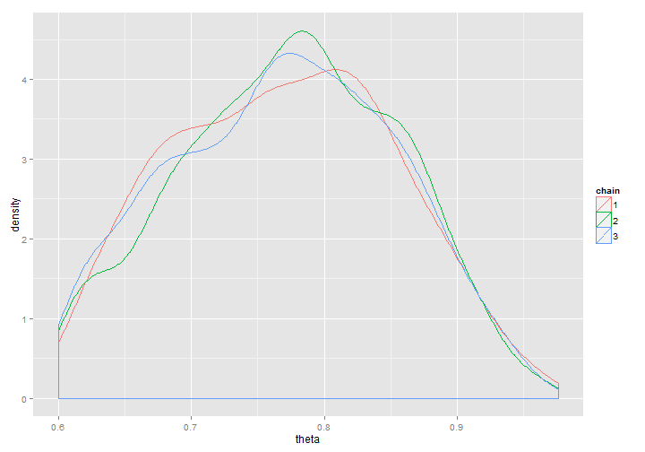

Doing Bayesian Data Analysis
Chapter 7 Homework
========================================================

## Nathan E. Rutenbeck

[GitHub repository for all courswork] (http://github.com/nerutenbeck/bayesian)

--------------------------------------------------------

## 7.1) Use varying proposal distributions in the Metropolis algorithm

### 7.1.A) SD = 0.1
 


### 7.1.B) SD = 0.001
 


### 7.1.C) SD = 100
 


### 7.1.D) The trial with the standard deviation of 0.1 (first trial) seems best, though it had a lower acceptance rate than the other two. This suggests there is some balance between the need to have enough accepted, but also to reject enough. Trials two and three had equal acceptance rates (higher than Trial 1)

### 7.1.E) I think looking visually at the results tells us a lot - though I suppose in a complicated case where the posterior is completely crazy you couldn't necessarily know, but for most models visual assessment seems like a good metric. I suppose this is where tests for convergence such as Rhat come in with Jags programming.

---------------------------------------------------------------------------

## 7.3) Apply Metropolis algorithm. Compare to grid approximation

### 7.3.A) $p(\theta|D)=\frac{p(D|\theta)p(\theta)}{p(D)} = \frac{p(D|\theta)p(\theta)}{\int p(D|\theta)p(\theta)} = \frac{(\theta^8)(1-\theta^{12-8})[(\cos(4\pi\theta+1)]^2}{\int d\theta(\theta^8)(1-\theta^{12-8})[(\cos(4\pi\theta+1)]^2}$ The prior and likelihood are probably not conjugate.

### 7.3.B) Estimation via grid approximation. Note the following output is one of the reasons I am increasingly annoyed by the canned Kruschke programs...

 

```
##    [1] 0.000e+00 2.035e-23 5.189e-21 1.324e-19 1.316e-18 7.810e-18
##    [7] 3.342e-17 1.141e-16 3.304e-16 8.431e-16 1.948e-15 4.152e-15
##   [13] 8.279e-15 1.561e-14 2.807e-14 4.844e-14 8.065e-14 1.301e-13
##   [19] 2.041e-13 3.124e-13 4.676e-13 6.857e-13 9.875e-13 1.398e-12
##   [25] 1.950e-12 2.682e-12 3.641e-12 4.883e-12 6.477e-12 8.502e-12
##   [31] 1.105e-11 1.424e-11 1.819e-11 2.305e-11 2.899e-11 3.620e-11
##   [37] 4.491e-11 5.536e-11 6.783e-11 8.264e-11 1.001e-10 1.207e-10
##   [43] 1.448e-10 1.728e-10 2.054e-10 2.431e-10 2.865e-10 3.363e-10
##   [49] 3.933e-10 4.582e-10 5.320e-10 6.156e-10 7.100e-10 8.164e-10
##   [55] 9.358e-10 1.070e-09 1.219e-09 1.386e-09 1.571e-09 1.776e-09
##   [61] 2.003e-09 2.254e-09 2.530e-09 2.833e-09 3.166e-09 3.531e-09
##   [67] 3.929e-09 4.364e-09 4.837e-09 5.350e-09 5.908e-09 6.511e-09
##   [73] 7.163e-09 7.867e-09 8.625e-09 9.441e-09 1.032e-08 1.126e-08
##   [79] 1.226e-08 1.334e-08 1.449e-08 1.571e-08 1.701e-08 1.840e-08
##   [85] 1.987e-08 2.143e-08 2.308e-08 2.482e-08 2.667e-08 2.861e-08
##   [91] 3.066e-08 3.282e-08 3.508e-08 3.746e-08 3.995e-08 4.256e-08
##   [97] 4.529e-08 4.814e-08 5.112e-08 5.422e-08 5.744e-08 6.080e-08
##  [103] 6.428e-08 6.790e-08 7.165e-08 7.553e-08 7.954e-08 8.368e-08
##  [109] 8.795e-08 9.235e-08 9.689e-08 1.015e-07 1.063e-07 1.112e-07
##  [115] 1.163e-07 1.214e-07 1.267e-07 1.321e-07 1.375e-07 1.431e-07
##  [121] 1.488e-07 1.546e-07 1.605e-07 1.664e-07 1.724e-07 1.785e-07
##  [127] 1.847e-07 1.909e-07 1.971e-07 2.034e-07 2.097e-07 2.161e-07
##  [133] 2.224e-07 2.288e-07 2.351e-07 2.414e-07 2.477e-07 2.540e-07
##  [139] 2.602e-07 2.663e-07 2.724e-07 2.784e-07 2.842e-07 2.900e-07
##  [145] 2.957e-07 3.012e-07 3.066e-07 3.118e-07 3.168e-07 3.217e-07
##  [151] 3.264e-07 3.309e-07 3.351e-07 3.392e-07 3.430e-07 3.465e-07
##  [157] 3.498e-07 3.529e-07 3.556e-07 3.581e-07 3.603e-07 3.621e-07
##  [163] 3.637e-07 3.650e-07 3.659e-07 3.665e-07 3.668e-07 3.667e-07
##  [169] 3.663e-07 3.656e-07 3.645e-07 3.630e-07 3.612e-07 3.591e-07
##  [175] 3.566e-07 3.538e-07 3.506e-07 3.471e-07 3.433e-07 3.391e-07
##  [181] 3.347e-07 3.299e-07 3.248e-07 3.194e-07 3.137e-07 3.078e-07
##  [187] 3.016e-07 2.951e-07 2.884e-07 2.815e-07 2.744e-07 2.671e-07
##  [193] 2.596e-07 2.520e-07 2.442e-07 2.362e-07 2.282e-07 2.201e-07
##  [199] 2.119e-07 2.037e-07 1.954e-07 1.871e-07 1.789e-07 1.706e-07
##  [205] 1.624e-07 1.543e-07 1.462e-07 1.383e-07 1.304e-07 1.227e-07
##  [211] 1.152e-07 1.078e-07 1.006e-07 9.359e-08 8.680e-08 8.024e-08
##  [217] 7.392e-08 6.784e-08 6.202e-08 5.646e-08 5.118e-08 4.618e-08
##  [223] 4.145e-08 3.702e-08 3.287e-08 2.900e-08 2.542e-08 2.213e-08
##  [229] 1.911e-08 1.636e-08 1.388e-08 1.166e-08 9.680e-09 7.937e-09
##  [235] 6.417e-09 5.107e-09 3.991e-09 3.056e-09 2.284e-09 1.660e-09
##  [241] 1.167e-09 7.876e-10 5.058e-10 3.049e-10 1.693e-10 8.392e-11
##  [247] 3.533e-11 1.149e-11 2.332e-12 1.497e-13 0.000e+00 1.579e-13
##  [253] 2.594e-12 1.348e-11 4.374e-11 1.096e-10 2.331e-10 4.430e-10
##  [259] 7.751e-10 1.273e-09 1.989e-09 2.986e-09 4.334e-09 6.117e-09
##  [265] 8.429e-09 1.138e-08 1.509e-08 1.969e-08 2.533e-08 3.219e-08
##  [271] 4.045e-08 5.031e-08 6.200e-08 7.576e-08 9.187e-08 1.106e-07
##  [277] 1.323e-07 1.573e-07 1.859e-07 2.186e-07 2.558e-07 2.980e-07
##  [283] 3.456e-07 3.991e-07 4.592e-07 5.265e-07 6.015e-07 6.850e-07
##  [289] 7.777e-07 8.804e-07 9.938e-07 1.119e-06 1.256e-06 1.408e-06
##  [295] 1.573e-06 1.754e-06 1.952e-06 2.168e-06 2.403e-06 2.659e-06
##  [301] 2.936e-06 3.236e-06 3.562e-06 3.913e-06 4.292e-06 4.701e-06
##  [307] 5.142e-06 5.616e-06 6.125e-06 6.671e-06 7.256e-06 7.883e-06
##  [313] 8.554e-06 9.270e-06 1.004e-05 1.085e-05 1.172e-05 1.265e-05
##  [319] 1.363e-05 1.468e-05 1.579e-05 1.697e-05 1.822e-05 1.955e-05
##  [325] 2.095e-05 2.243e-05 2.400e-05 2.566e-05 2.741e-05 2.925e-05
##  [331] 3.120e-05 3.325e-05 3.541e-05 3.768e-05 4.006e-05 4.257e-05
##  [337] 4.520e-05 4.797e-05 5.087e-05 5.390e-05 5.709e-05 6.042e-05
##  [343] 6.391e-05 6.756e-05 7.138e-05 7.536e-05 7.953e-05 8.387e-05
##  [349] 8.841e-05 9.314e-05 9.807e-05 1.032e-04 1.085e-04 1.141e-04
##  [355] 1.199e-04 1.259e-04 1.322e-04 1.387e-04 1.454e-04 1.524e-04
##  [361] 1.597e-04 1.672e-04 1.750e-04 1.831e-04 1.915e-04 2.002e-04
##  [367] 2.092e-04 2.185e-04 2.281e-04 2.381e-04 2.483e-04 2.589e-04
##  [373] 2.699e-04 2.812e-04 2.929e-04 3.049e-04 3.173e-04 3.301e-04
##  [379] 3.433e-04 3.568e-04 3.708e-04 3.851e-04 3.999e-04 4.151e-04
##  [385] 4.308e-04 4.468e-04 4.633e-04 4.803e-04 4.977e-04 5.155e-04
##  [391] 5.338e-04 5.526e-04 5.719e-04 5.916e-04 6.118e-04 6.325e-04
##  [397] 6.538e-04 6.755e-04 6.977e-04 7.204e-04 7.436e-04 7.674e-04
##  [403] 7.917e-04 8.165e-04 8.418e-04 8.676e-04 8.940e-04 9.210e-04
##  [409] 9.484e-04 9.764e-04 1.005e-03 1.034e-03 1.064e-03 1.094e-03
##  [415] 1.125e-03 1.156e-03 1.188e-03 1.220e-03 1.253e-03 1.287e-03
##  [421] 1.321e-03 1.355e-03 1.390e-03 1.426e-03 1.462e-03 1.499e-03
##  [427] 1.536e-03 1.574e-03 1.612e-03 1.651e-03 1.690e-03 1.730e-03
##  [433] 1.770e-03 1.811e-03 1.853e-03 1.894e-03 1.937e-03 1.979e-03
##  [439] 2.023e-03 2.066e-03 2.110e-03 2.155e-03 2.200e-03 2.245e-03
##  [445] 2.291e-03 2.337e-03 2.383e-03 2.430e-03 2.477e-03 2.525e-03
##  [451] 2.573e-03 2.621e-03 2.670e-03 2.718e-03 2.767e-03 2.817e-03
##  [457] 2.866e-03 2.916e-03 2.966e-03 3.016e-03 3.066e-03 3.117e-03
##  [463] 3.167e-03 3.218e-03 3.269e-03 3.320e-03 3.371e-03 3.422e-03
##  [469] 3.473e-03 3.524e-03 3.575e-03 3.626e-03 3.677e-03 3.728e-03
##  [475] 3.779e-03 3.829e-03 3.880e-03 3.930e-03 3.980e-03 4.030e-03
##  [481] 4.080e-03 4.129e-03 4.178e-03 4.227e-03 4.276e-03 4.324e-03
##  [487] 4.372e-03 4.419e-03 4.466e-03 4.513e-03 4.559e-03 4.605e-03
##  [493] 4.650e-03 4.694e-03 4.738e-03 4.782e-03 4.825e-03 4.867e-03
##  [499] 4.909e-03 4.950e-03 4.990e-03 5.029e-03 5.068e-03 5.106e-03
##  [505] 5.144e-03 5.180e-03 5.216e-03 5.251e-03 5.285e-03 5.318e-03
##  [511] 5.350e-03 5.381e-03 5.412e-03 5.441e-03 5.470e-03 5.497e-03
##  [517] 5.524e-03 5.549e-03 5.574e-03 5.597e-03 5.619e-03 5.641e-03
##  [523] 5.661e-03 5.680e-03 5.698e-03 5.714e-03 5.730e-03 5.745e-03
##  [529] 5.758e-03 5.770e-03 5.781e-03 5.791e-03 5.799e-03 5.806e-03
##  [535] 5.813e-03 5.817e-03 5.821e-03 5.824e-03 5.825e-03 5.825e-03
##  [541] 5.823e-03 5.821e-03 5.817e-03 5.812e-03 5.806e-03 5.798e-03
##  [547] 5.789e-03 5.779e-03 5.768e-03 5.755e-03 5.741e-03 5.726e-03
##  [553] 5.710e-03 5.693e-03 5.674e-03 5.654e-03 5.633e-03 5.611e-03
##  [559] 5.587e-03 5.563e-03 5.537e-03 5.510e-03 5.482e-03 5.453e-03
##  [565] 5.423e-03 5.391e-03 5.359e-03 5.325e-03 5.291e-03 5.255e-03
##  [571] 5.219e-03 5.181e-03 5.143e-03 5.103e-03 5.063e-03 5.022e-03
##  [577] 4.980e-03 4.937e-03 4.893e-03 4.848e-03 4.803e-03 4.756e-03
##  [583] 4.709e-03 4.662e-03 4.613e-03 4.564e-03 4.515e-03 4.464e-03
##  [589] 4.413e-03 4.362e-03 4.310e-03 4.257e-03 4.204e-03 4.150e-03
##  [595] 4.096e-03 4.042e-03 3.987e-03 3.932e-03 3.876e-03 3.821e-03
##  [601] 3.765e-03 3.708e-03 3.652e-03 3.595e-03 3.538e-03 3.481e-03
##  [607] 3.424e-03 3.367e-03 3.310e-03 3.252e-03 3.195e-03 3.138e-03
##  [613] 3.080e-03 3.023e-03 2.966e-03 2.909e-03 2.853e-03 2.796e-03
##  [619] 2.740e-03 2.683e-03 2.628e-03 2.572e-03 2.517e-03 2.462e-03
##  [625] 2.407e-03 2.353e-03 2.299e-03 2.245e-03 2.192e-03 2.139e-03
##  [631] 2.087e-03 2.036e-03 1.984e-03 1.934e-03 1.884e-03 1.834e-03
##  [637] 1.785e-03 1.737e-03 1.689e-03 1.642e-03 1.595e-03 1.549e-03
##  [643] 1.504e-03 1.459e-03 1.415e-03 1.372e-03 1.330e-03 1.288e-03
##  [649] 1.247e-03 1.206e-03 1.167e-03 1.128e-03 1.089e-03 1.052e-03
##  [655] 1.015e-03 9.792e-04 9.439e-04 9.095e-04 8.757e-04 8.428e-04
##  [661] 8.106e-04 7.792e-04 7.485e-04 7.186e-04 6.894e-04 6.610e-04
##  [667] 6.334e-04 6.064e-04 5.803e-04 5.548e-04 5.301e-04 5.062e-04
##  [673] 4.829e-04 4.604e-04 4.386e-04 4.174e-04 3.970e-04 3.772e-04
##  [679] 3.582e-04 3.398e-04 3.220e-04 3.049e-04 2.884e-04 2.726e-04
##  [685] 2.573e-04 2.427e-04 2.286e-04 2.152e-04 2.023e-04 1.899e-04
##  [691] 1.781e-04 1.668e-04 1.561e-04 1.458e-04 1.360e-04 1.268e-04
##  [697] 1.179e-04 1.096e-04 1.016e-04 9.412e-05 8.702e-05 8.032e-05
##  [703] 7.401e-05 6.806e-05 6.247e-05 5.723e-05 5.231e-05 4.772e-05
##  [709] 4.343e-05 3.943e-05 3.571e-05 3.225e-05 2.905e-05 2.609e-05
##  [715] 2.337e-05 2.086e-05 1.855e-05 1.645e-05 1.452e-05 1.277e-05
##  [721] 1.119e-05 9.751e-06 8.459e-06 7.300e-06 6.264e-06 5.343e-06
##  [727] 4.528e-06 3.810e-06 3.182e-06 2.634e-06 2.161e-06 1.755e-06
##  [733] 1.410e-06 1.118e-06 8.746e-07 6.733e-07 5.092e-07 3.772e-07
##  [739] 2.728e-07 1.919e-07 1.305e-07 8.530e-08 5.303e-08 3.095e-08
##  [745] 1.663e-08 7.983e-09 3.254e-09 1.025e-09 2.014e-10 1.252e-11
##  [751] 0.000e+00 1.239e-11 1.971e-10 9.924e-10 3.118e-09 7.568e-09
##  [757] 1.560e-08 2.872e-08 4.869e-08 7.748e-08 1.173e-07 1.706e-07
##  [763] 2.400e-07 3.282e-07 4.384e-07 5.735e-07 7.369e-07 9.320e-07
##  [769] 1.162e-06 1.432e-06 1.744e-06 2.103e-06 2.512e-06 2.976e-06
##  [775] 3.498e-06 4.082e-06 4.734e-06 5.456e-06 6.253e-06 7.129e-06
##  [781] 8.087e-06 9.133e-06 1.027e-05 1.150e-05 1.283e-05 1.426e-05
##  [787] 1.580e-05 1.744e-05 1.920e-05 2.107e-05 2.307e-05 2.518e-05
##  [793] 2.742e-05 2.978e-05 3.227e-05 3.489e-05 3.765e-05 4.054e-05
##  [799] 4.357e-05 4.673e-05 5.003e-05 5.347e-05 5.704e-05 6.076e-05
##  [805] 6.462e-05 6.861e-05 7.275e-05 7.702e-05 8.142e-05 8.596e-05
##  [811] 9.064e-05 9.544e-05 1.004e-04 1.054e-04 1.106e-04 1.159e-04
##  [817] 1.214e-04 1.269e-04 1.325e-04 1.383e-04 1.441e-04 1.501e-04
##  [823] 1.561e-04 1.623e-04 1.685e-04 1.747e-04 1.811e-04 1.875e-04
##  [829] 1.940e-04 2.005e-04 2.071e-04 2.137e-04 2.203e-04 2.270e-04
##  [835] 2.337e-04 2.404e-04 2.471e-04 2.537e-04 2.604e-04 2.671e-04
##  [841] 2.737e-04 2.803e-04 2.868e-04 2.933e-04 2.997e-04 3.061e-04
##  [847] 3.124e-04 3.185e-04 3.246e-04 3.306e-04 3.365e-04 3.423e-04
##  [853] 3.480e-04 3.535e-04 3.589e-04 3.641e-04 3.692e-04 3.741e-04
##  [859] 3.789e-04 3.834e-04 3.878e-04 3.921e-04 3.961e-04 3.999e-04
##  [865] 4.035e-04 4.069e-04 4.101e-04 4.131e-04 4.159e-04 4.184e-04
##  [871] 4.207e-04 4.228e-04 4.246e-04 4.262e-04 4.275e-04 4.286e-04
##  [877] 4.295e-04 4.301e-04 4.304e-04 4.305e-04 4.304e-04 4.300e-04
##  [883] 4.293e-04 4.284e-04 4.273e-04 4.259e-04 4.242e-04 4.223e-04
##  [889] 4.202e-04 4.178e-04 4.152e-04 4.123e-04 4.093e-04 4.060e-04
##  [895] 4.024e-04 3.987e-04 3.947e-04 3.906e-04 3.862e-04 3.816e-04
##  [901] 3.769e-04 3.720e-04 3.668e-04 3.616e-04 3.561e-04 3.505e-04
##  [907] 3.448e-04 3.389e-04 3.329e-04 3.267e-04 3.205e-04 3.141e-04
##  [913] 3.076e-04 3.011e-04 2.944e-04 2.877e-04 2.809e-04 2.741e-04
##  [919] 2.672e-04 2.603e-04 2.534e-04 2.464e-04 2.394e-04 2.324e-04
##  [925] 2.254e-04 2.184e-04 2.115e-04 2.046e-04 1.977e-04 1.908e-04
##  [931] 1.841e-04 1.773e-04 1.707e-04 1.641e-04 1.576e-04 1.512e-04
##  [937] 1.449e-04 1.386e-04 1.325e-04 1.265e-04 1.207e-04 1.149e-04
##  [943] 1.093e-04 1.038e-04 9.843e-05 9.321e-05 8.814e-05 8.321e-05
##  [949] 7.843e-05 7.381e-05 6.933e-05 6.501e-05 6.085e-05 5.685e-05
##  [955] 5.300e-05 4.931e-05 4.578e-05 4.241e-05 3.919e-05 3.613e-05
##  [961] 3.322e-05 3.046e-05 2.786e-05 2.540e-05 2.309e-05 2.092e-05
##  [967] 1.889e-05 1.699e-05 1.523e-05 1.359e-05 1.208e-05 1.069e-05
##  [973] 9.405e-06 8.235e-06 7.170e-06 6.205e-06 5.334e-06 4.553e-06
##  [979] 3.857e-06 3.239e-06 2.695e-06 2.220e-06 1.808e-06 1.455e-06
##  [985] 1.154e-06 9.007e-07 6.906e-07 5.187e-07 3.804e-07 2.713e-07
##  [991] 1.871e-07 1.239e-07 7.811e-08 4.621e-08 2.517e-08 1.225e-08
##  [997] 5.061e-09 1.615e-09 3.217e-10 2.027e-11 0.000e+00
```


### 7.3.C) Estimation via Metropolis algorithm. It is possible to generate a posterior sample either by normalizing the prior or not. Normalizing the posterior generates a different result than in using the grid approximation, however. Results below are with a non-normalized prior.

 


### 7.3.D) While I'm sure there is a way to use JAGS here, I think it's beyond my skill level. I believe the definition of the prior has to be a stochastic node within the JAGS model, and we don't have any immediate way to specify the prior density as one of the distributions already programmed into JAGS. Below is my best shot in the short term at emulating the in-class example from the next chapter. Not sure what the problem is...


```r
require(R2jags)
```

```
## Loading required package: R2jags
```

```
## Warning: package 'R2jags' was built under R version 3.0.2
```

```
## Loading required package: rjags
```

```
## Warning: package 'rjags' was built under R version 3.0.2
```

```
## Loading required package: coda
## Loading required package: lattice
## Linked to JAGS 3.4.0
## Loaded modules: basemod,bugs
## 
## Attaching package: 'R2jags'
## 
## The following object is masked from 'package:coda':
## 
##     traceplot
```

```r
jm1 <- function() {
    # Likelihood
    for (i in 1:n) {
        y[i] ~ dbern(theta)
    }
    
    # Prior
    tmp ~ dunif(0, 1)
    theta <- (cos(4 * tmp * pi + 1))^2
}

n.iter = 500
n.burnin = 50
params = c("theta")

y = c(rep(1, 8), rep(0, 4))
data = list(y = y, n = length(y))
jm1.fit <- jags(data = data, inits = NULL, params, model.file = jm1, n.iter = n.iter, 
    n.burnin = n.burnin)
```

```
## module glm loaded
```

```
## Compiling model graph
##    Resolving undeclared variables
##    Allocating nodes
## Deleting model
```

```
## Error: RUNTIME ERROR:
## Compilation error on line 4.
## Unknown parameter theta
```


--------------------------------------------------------------------------------------

## 7.5) Use JAGS, explore model comparison. I used model-fitting and post-processing techniques that differ somewhat from Kruschke's recommendations. I am including with the homework file two short functions I built to coerce the output from the fit jags models to data frames and to plot the chains (mcjags.R). The model with the lowest deviance should have the highest predictive power. In this case it's model 3, which makes sense given the data. Interestingly, however, the effective sample size for estimating theta is lowest in model 3.


### Model 1


```
## Inference for Bugs model at "C:/Users/Stoneset/AppData/Local/Temp/RtmpcpjKDW/modele78127c299f.txt", fit using jags,
##  3 chains, each with 5000 iterations (first 500 discarded), n.thin = 4
##  n.sims = 3375 iterations saved
##          mu.vect sd.vect   2.5%   25%    50%    75%  97.5%  Rhat n.eff
## theta      0.365   0.032  0.284  0.35  0.373  0.389  0.399 1.009  3400
## deviance  25.013   1.836 23.263 23.73 24.490 25.662 29.670 1.005  3400
## 
## For each parameter, n.eff is a crude measure of effective sample size,
## and Rhat is the potential scale reduction factor (at convergence, Rhat=1).
## 
## DIC info (using the rule, pD = var(deviance)/2)
## pD = 1.7 and DIC = 26.7
## DIC is an estimate of expected predictive error (lower deviance is better).
```

   


### Model 2


```
## Inference for Bugs model at "C:/Users/Stoneset/AppData/Local/Temp/RtmpcpjKDW/modele7826ca7f8b.txt", fit using jags,
##  3 chains, each with 5000 iterations (first 500 discarded), n.thin = 4
##  n.sims = 3375 iterations saved
##          mu.vect sd.vect   2.5%    25%    50%   75%  97.5%  Rhat n.eff
## theta      0.545   0.044  0.434  0.519  0.556  0.58  0.598 1.001  3400
## deviance  18.192   1.321 16.772 17.180 17.784 18.83 21.777 1.001  3400
## 
## For each parameter, n.eff is a crude measure of effective sample size,
## and Rhat is the potential scale reduction factor (at convergence, Rhat=1).
## 
## DIC info (using the rule, pD = var(deviance)/2)
## pD = 0.9 and DIC = 19.1
## DIC is an estimate of expected predictive error (lower deviance is better).
```

   


### Model 3


```
## Inference for Bugs model at "C:/Users/Stoneset/AppData/Local/Temp/RtmpcpjKDW/modele782dc656de.txt", fit using jags,
##  3 chains, each with 5000 iterations (first 500 discarded), n.thin = 4
##  n.sims = 3375 iterations saved
##          mu.vect sd.vect   2.5%    25%    50%    75%  97.5%  Rhat n.eff
## theta      0.771   0.083  0.616  0.707  0.774  0.834  0.924 1.001  3300
## deviance  15.170   0.813 14.549 14.618 14.883 15.428 17.177 1.001  3400
## 
## For each parameter, n.eff is a crude measure of effective sample size,
## and Rhat is the potential scale reduction factor (at convergence, Rhat=1).
## 
## DIC info (using the rule, pD = var(deviance)/2)
## pD = 0.3 and DIC = 15.5
## DIC is an estimate of expected predictive error (lower deviance is better).
```

   


