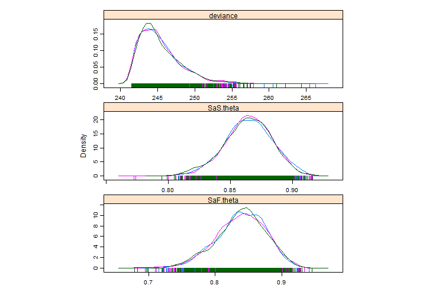
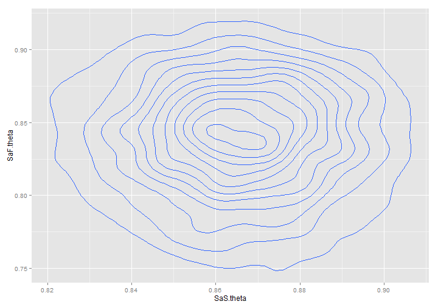
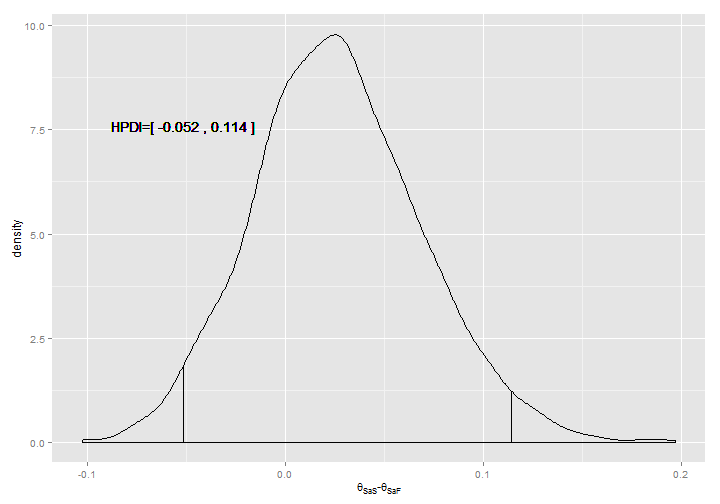
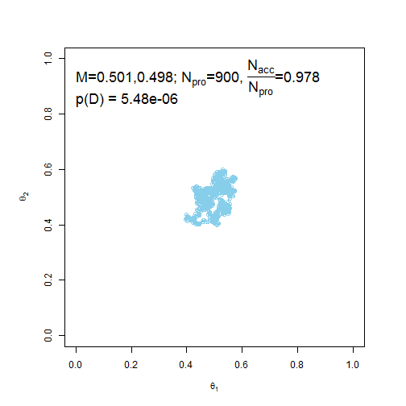
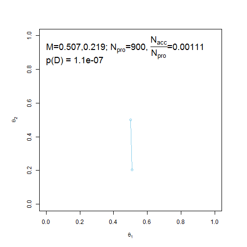

Doing Bayesian Data Analysis
Chapter 8 Homework
========================================================

## Nathan E. Rutenbeck

[GitHub repository for all courswork] (http://github.com/nerutenbeck/bayesian)

--------------------------------------------------------

## 8.1) Larry Bird's hot hand.

### 8.1.A) Let SaS=success after success. Let SaF=success after failure.


```
## function(){
##   #Likelihood
##   for(i in 1:nSaS){
##     SaS[i]~dbern(SaS.theta)
##   }
##   for(i in 1:nSaF){
##     SaF[i]~dbern(SaF.theta)
##   }
##   
##   #Prior
##   SaS.theta~dbeta(30,10)
##   SaF.theta~dbeta(30,10)
## }
```

```
## Compiling model graph
##    Resolving undeclared variables
##    Allocating nodes
##    Graph Size: 344
## 
## Initializing model
```

```
## Inference for Bugs model at "C:/Users/Stoneset/AppData/Local/Temp/Rtmps7Wuat/model69c506827ee.txt", fit using jags,
##  3 chains, each with 5000 iterations (first 500 discarded), n.thin = 4
##  n.sims = 3375 iterations saved
##           mu.vect sd.vect    2.5%     25%     50%     75%   97.5%  Rhat
## SaF.theta   0.838   0.038   0.758   0.815   0.841   0.865   0.905 1.001
## SaS.theta   0.864   0.019   0.824   0.852   0.865   0.878   0.900 1.001
## deviance  245.357   2.892 241.777 243.241 244.714 246.773 252.815 1.001
##           n.eff
## SaF.theta  3400
## SaS.theta  3100
## deviance   3400
## 
## For each parameter, n.eff is a crude measure of effective sample size,
## and Rhat is the potential scale reduction factor (at convergence, Rhat=1).
## 
## DIC info (using the rule, pD = var(deviance)/2)
## pD = 4.2 and DIC = 249.5
## DIC is an estimate of expected predictive error (lower deviance is better).
```

   


### 8.2.B) Doesn't look like the 'hot hand' theory holds because the HPDI of the difference between $\theta_{SaS}$ and $\theta_{SaF}$ contains zero. This is intuitive also because the posterior distributions of $\theta_{SaS}$ and $\theta_{SaF}$ are so close together.

## 8.4) Tuning the Metropolis Algorithm

 


### 8.4.1) The standard deviation of the jump is very small so there is high correlation of all the accepted values. In other words, such a small standard deviation for tuning results in the exploration of only a small portion of the parameter space

 


### 8.4.B) A high standard deviation in the proposal distribution leads to an extremely low acceptance rate, so almost none of the parameter space is filled. Unlike in 8.4.A, when jumps were too small such that the space is filled inefficiently, in this case it is because all proposed jumps move too far out of the parameter space such that almost none are accepted.
