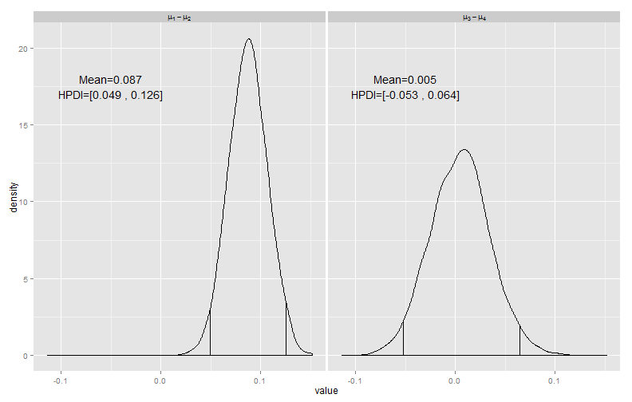
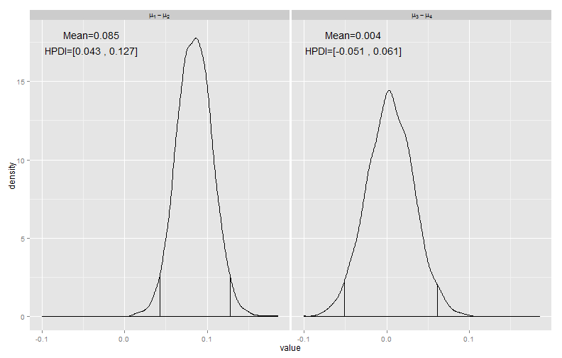
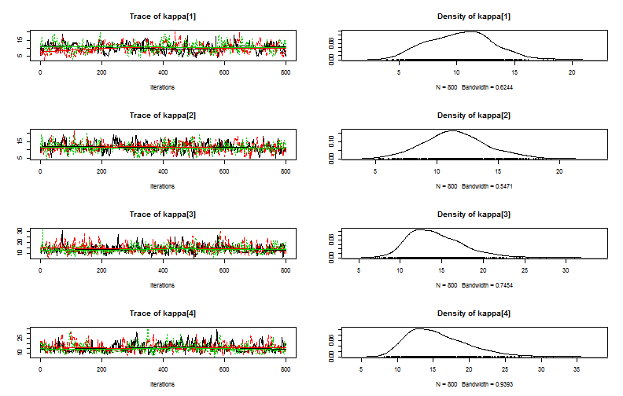
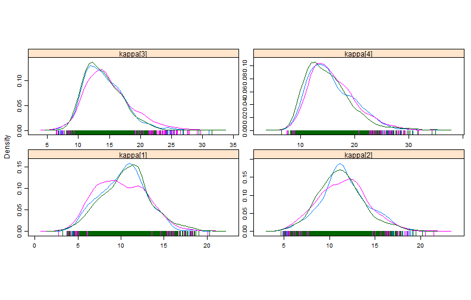

Doing Bayesian Data Analysis
Chapter 9 Homework
========================================================

## Nathan E. Rutenbeck

[GitHub repository for all courswork] (http://github.com/nerutenbeck/bayesian)

--------------------------------------------------------


## 9.2 Assumptions regarding cross-group constraints

### 9.2.A Differences in distributions of $\kappa$

#### 9.2.A.1 The model


```r
# THE MODEL.

jm1 <- function() {
    for (subjIdx in 1:nSubj) {
        # Likelihood:
        z[subjIdx] ~ dbin(theta[subjIdx], N[subjIdx])
        # Prior on theta: Notice nested indexing.
        theta[subjIdx] ~ dbeta(a[cond[subjIdx]], b[cond[subjIdx]])
    }
    for (condIdx in 1:nCond) {
        a[condIdx] <- mu[condIdx] * kappa
        b[condIdx] <- (1 - mu[condIdx]) * kappa
        # Hyperprior on mu
        mu[condIdx] ~ dbeta(Amu, Bmu)
    }
    # Constants for hyperprior:
    Amu <- 1
    Bmu <- 1
    kappa ~ dgamma(Skappa, Rkappa)
    Skappa <- pow(meanGamma, 2)/pow(sdGamma, 2)
    Rkappa <- meanGamma/pow(sdGamma, 2)
    meanGamma <- 10
    sdGamma <- 10
}
```


#### 9.2.A.2 The posterior distribution. As a side note, I wonder how important specifying initialization is for these models. I continue to get good results just letting JAGS pick starting values.


```
## Compiling model graph
##    Resolving undeclared variables
##    Allocating nodes
##    Graph Size: 668
## 
## Initializing model
```

 


#### 9.2.A.3 The graphs look different because of the differences in assumptions regarding $\kappa$, and the different relationships between $\kappa$ and $\mu_i$ in each model. In the first filtration/condensation model represented in the textbook, the $a$ and $b$ parameters for each $\mu_i$ vary more widely because each $\mu_i$ has dependency on a unique $\kappa_i$\, all of which come from the same distribution, the shape of which is estimated from the data. In the second model by contrast, once defined from the underlying $\Gamma (10,0.1)$ distribution the value of $\kappa$ is identical for each $\mu_i$ . In other words, within-group variability around each $\mu_i$ is assumed to be the same in all cases. Wide distributions of $\mu_i$ get shrunk toward the mean, and narrow distributions get expanded. The distribution of each $\mu_i$ is therefore identically constrained around the mean, and different amounts of shrinkage between the two models results in this case in greater differences between $\mu_1$ and $\mu_2$.

### 9.2.B Change structure of $\kappa$ again to reflect a higher level of dependency

#### 9.2.B.1 The model


```r
# THE MODEL.

jm2 <- function() {
    for (subjIdx in 1:nSubj) {
        # Likelihood:
        z[subjIdx] ~ dbin(theta[subjIdx], N[subjIdx])
        # Prior on theta: Notice nested indexing.
        theta[subjIdx] ~ dbeta(a[cond[subjIdx]], b[cond[subjIdx]])
    }
    for (condIdx in 1:nCond) {
        a[condIdx] <- mu[condIdx] * kappa[condIdx]
        b[condIdx] <- (1 - mu[condIdx]) * kappa[condIdx]
        # Hyperpriors on mu and kappa
        mu[condIdx] ~ dbeta(Amu, Bmu)
        kappa[condIdx] ~ dgamma(Skappa, Rkappa)
    }
    # Constants for hyperprior:
    Amu <- 1
    Bmu <- 1
    Skappa <- pow(meanGamma, 2)/pow(sdGamma, 2)
    Rkappa <- meanGamma/pow(sdGamma, 2)
    meanGamma ~ dunif(0.01, 30)
    sdGamma ~ dunif(0.01, 30)
}
```


#### 9.2.B.2 The posterior distribution


```
## Compiling model graph
##    Resolving undeclared variables
##    Allocating nodes
##    Graph Size: 674
## 
## Initializing model
```

 


#### 9.2.B.3 The distributions do not very a whole lot. That said, in this model the shape of the distribution for each $\kappa_i$ is unique but the distribution of possible parameter values defining each underlying Gamma distribution is the same. The distribution of each $\mu_i$ will therefore be dependent on its own corresponding $\kappa_i$, but the parameters defining each $\kappa_i$ are similarly constrained. This causes a sort of middle ground in the flexibility of the $\mu_i$ distributions - there is shrinkage because of the underlying dependencies represented by the identical constraints on parameters of the Gamma distributions defining $\kappa_i$, but not as much as when $\kappa$ was identical in all cases.

## 9.3 Burn-in, thinning, and autocorrelation

#### These plots show that values for kappa are highly autocorrelated without thinning, and that the chains do not mix well during the first 800 or so iterations. This highlights the importance of thinning to reduce the effect of autocorrelation in the posterior distribution, as well as the importance of the burnin period to select values after mixing has occurred.


```
## Compiling model graph
##    Resolving undeclared variables
##    Allocating nodes
##    Graph Size: 674
## 
## Initializing model
```

  

